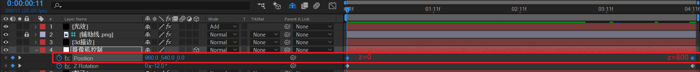
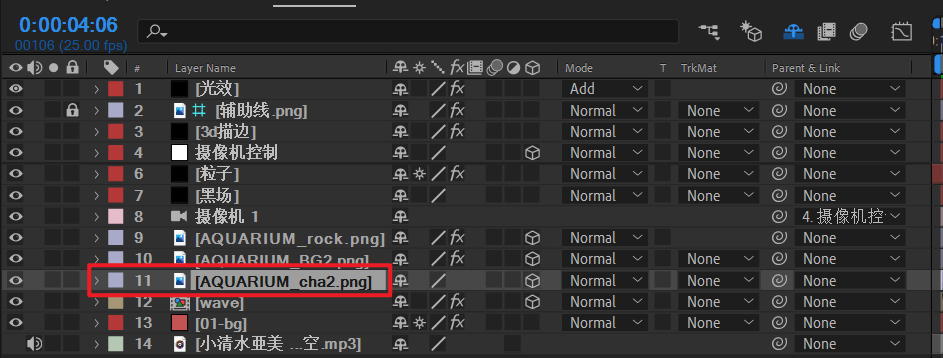
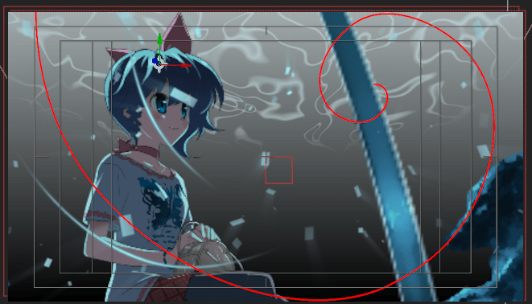
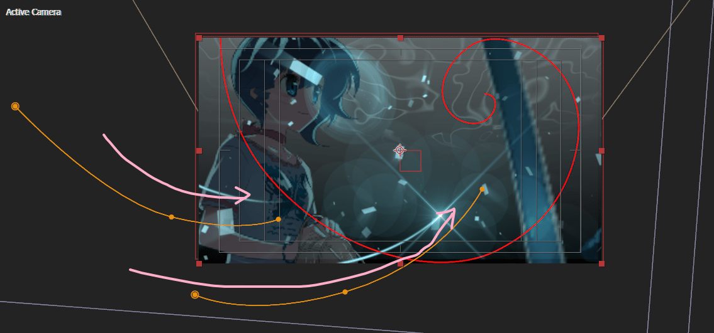

# 02

将之前的01合成复制一份，命名02，放于02文件夹。

打开摄像机控制（null object），将position关键帧全选，然后反向时间关键帧。

也就是这是一个z=0 => z=800变化的镜头，是推（近）的镜头。

> 注意不要导入PNG 序列，一般图片使用PNG文件格式导入。

替换图片素材。

1. 导入PNG文件新人物到02文件夹。
2. 将选中人物图层，按住alt键不放。将新人物素材拖到要被替换的就图层上，松开alt键即可。

接下来，将02合成的柱子，假山分别移动到右侧。

这里依然以合成结束的最后一帧，作为结束的关键帧参考点来构图。

接下来，调整曲线和扫光的位置，并重新K扫光的帧。

> 重点：扫光路径的中间所有的帧，全选后，鼠标右键，rove over time。这样AE会进行平滑曲线拟合。这样曲线更加自然。

这样，02完成。

> 这里02合成的时间长度不对，后面统一处理。

