# 05

这个镜头为：黑色渐变揭示，一个快速得环形旋转过渡，然后显示小娃娃。

先裁剪音乐

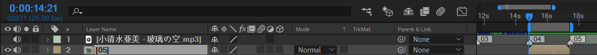

ctrl shift C创建预合成，进入预合成，裁剪至工作区长度

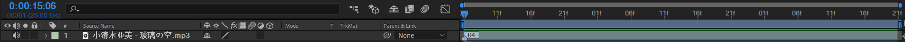

接下来，导入素材。

> 提示：对于PSD素材，在windows 10系统中建议使用任意一款预览缩略图的软件。例如 PSD codec

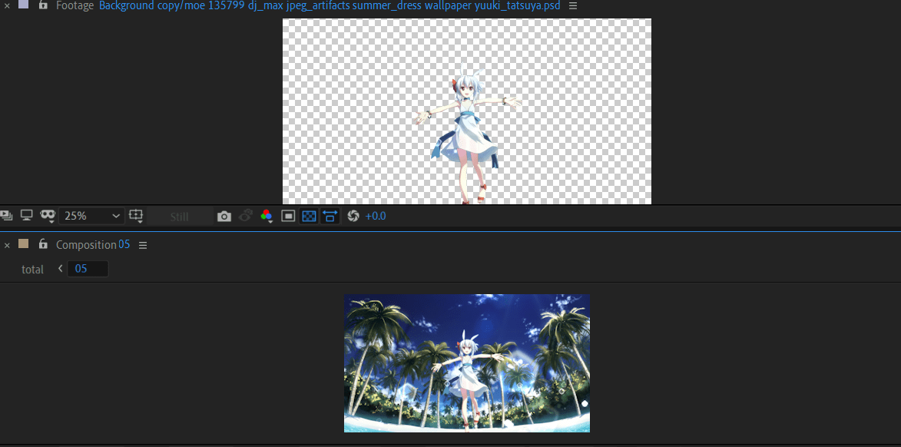

对这个两个图层应用3D空间。

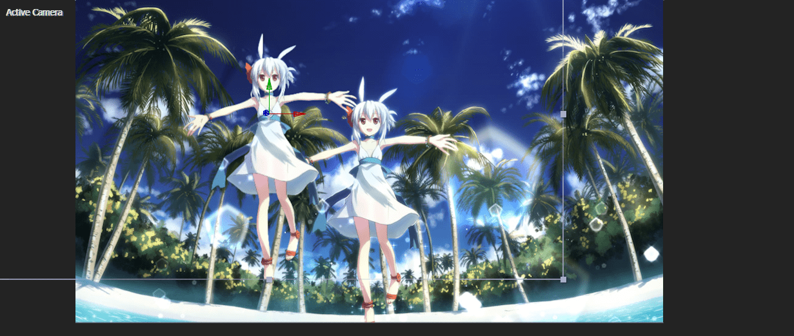

> 构图时，人物的Z轴一般为0，背景z轴>0，前景z轴<0。

背景 z=2000， 人物z=0，定版构图为

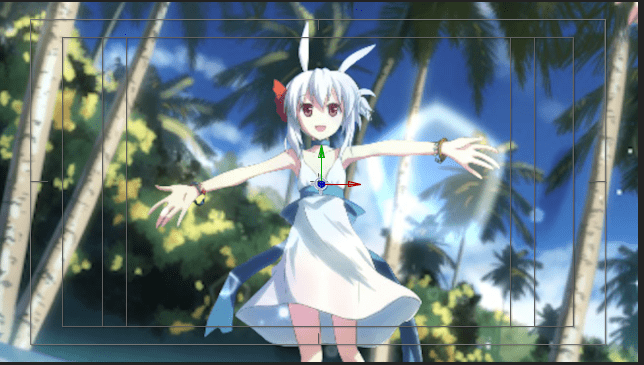

下面实现粒子效果

使用RG trapcode particular创建如下效果。

关键参数：星星texture

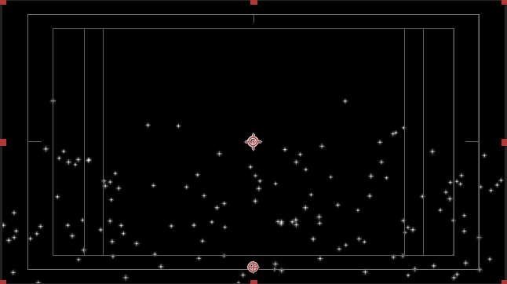

给一定的随机大小百分比

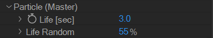

结合场景的初步效果

为了在开始的时候，也能出现粒子效果，需要需要设置pre-run

目前，粒子的消失是直接消失的。如果让粒子的不透明度随着它的生命周期变化而变化，那就可以更加自然。

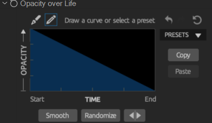

新建一个空对象，将摄像机链接到该空对象。

先创建结束帧

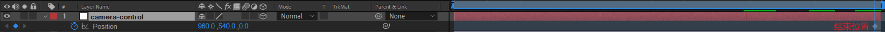

在初始时间点，设置Z为一个较大的正值，例如1800。操作过程的效果（逆向）。

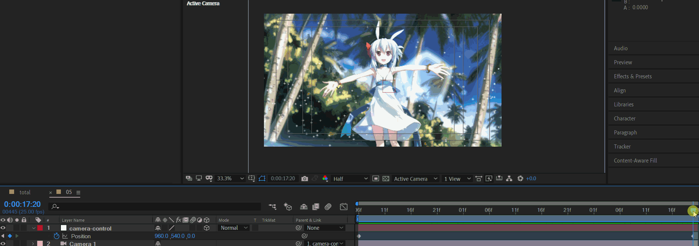

当前速度曲线是匀速的，所以需要选中position这行，点击速度曲线按钮打开面板。将曲线调整成以下形状。

> 注意务必保证调整的是速度图表，而不是值图表。

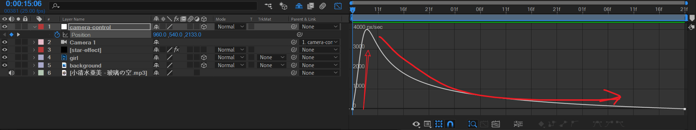

从上面图表看出，开始斜率很大，代表一个急速的运动（加速），然后，速度到峰值后，速度缓慢地下降。

这就给人一种快速进入的视觉冲击感。这个时间点注意卡好音乐的鼓点。这个鼓点就是开始唱歌的那一瞬间。

此时，还有一个问题：画面运动时，摄像机周围的地方，焦点应该是模糊，因为人眼睛的关注点在于人物，人物才是焦点。其他地方都不是焦点。看一下原作的效果截图

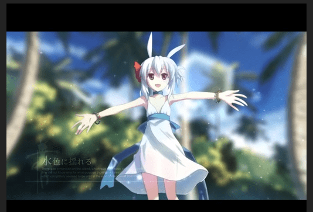

背景都被模糊化了。

所以，我们需要打开摄像机的景深以及加大摄像机的光圈。

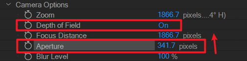

景深是为了模糊背景。光圈与曝光没关系，仅影响景深。

下面来实验一下，将光圈加大到一个离谱的数值，图中为5000。效果如下。

> 研究变量的方法论：当一个值不清楚它的效果时，设置较大的极限值，就能看出明显的效果。

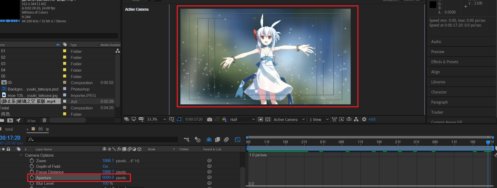

而将光圈设置为0时，背景又变清晰了。

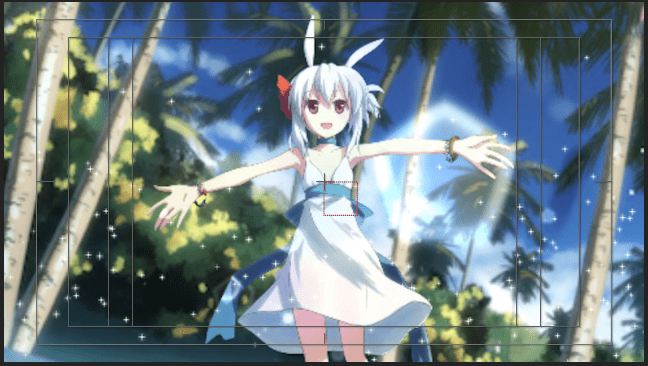

也就是说，光圈为0，等于全景聚焦。光圈为大的正值，就是局部聚焦，模糊周围。

实验完成后，将光圈调回500。同时，将摄像机的运动模糊打开，设置粒子运动模糊。这样粒子运动更真实。

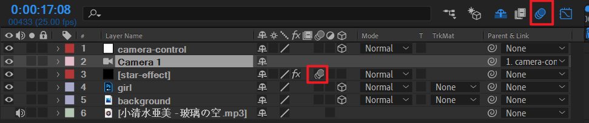

好了，文字先不处理。这个镜头初步完成。