# 06

以相同的方式裁剪音乐片段，预合成，裁剪工作区。以后这个步骤就不会赘述了。

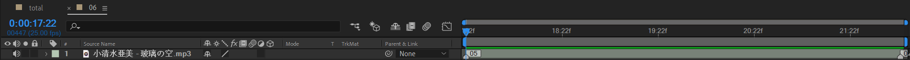

导入两张图片后，适当缩放，使得都是天空场景。

新建一个固态层作为遮罩作用。这个层选中后，点击矩形工具双击创建一个mask（这步非常重要）。然后使用ctrl shift + 单击调整mask的位置和大小如图所示，位于中间。bg1使用alpha遮罩。

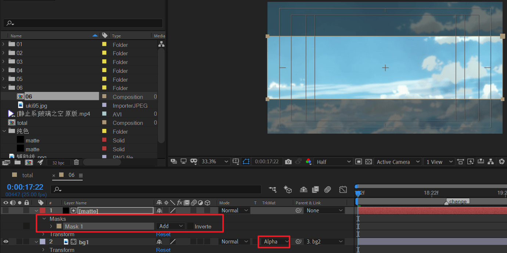

由于两个场景都会稍微向左平移。为了保证运动一致，使用父子链接，将bg1绑定到bg2，bg1的运动就跟随bg2了。

移动一下看看效果。中间层和背景层的云朵运动速度一致，非常难看。

> 这里，一个更好的做法是分别对两层K x轴的位移，不使用父子绑定，从而制造视差上的运动速度不一致的效果。
>
> 外层运动稍快，里层运动稍慢。但是，作为教程来说，这里暂不处理。

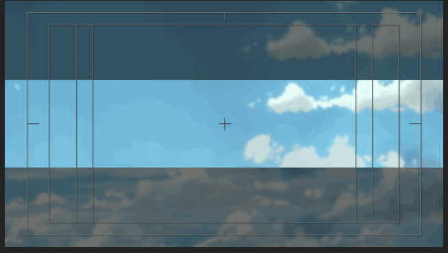

这里，需要识别音乐歌词变化的一个关键点。

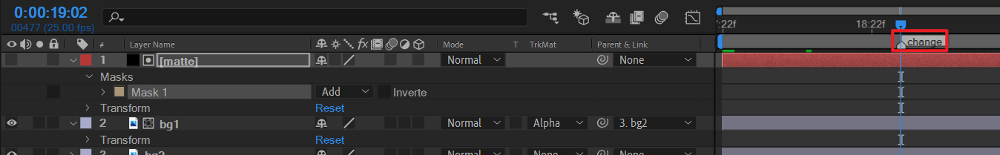

ctrl shift将mask移出右侧，自动在开头生成一个关键帧。

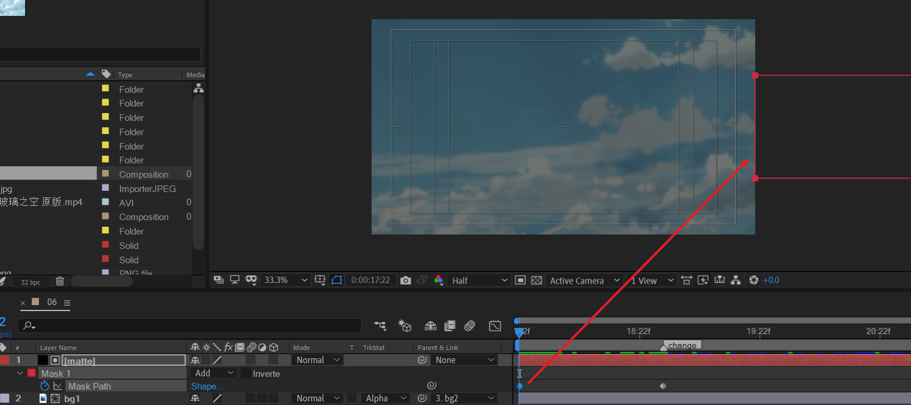

先做一个快速进入的mask路径动画

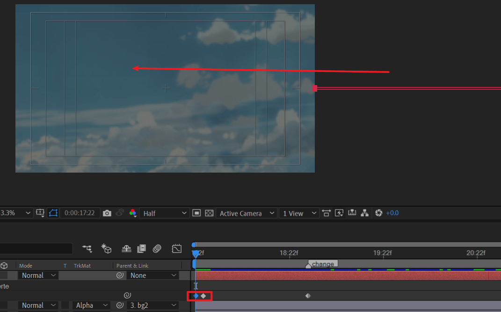

然后，做一个缓慢的mask展开

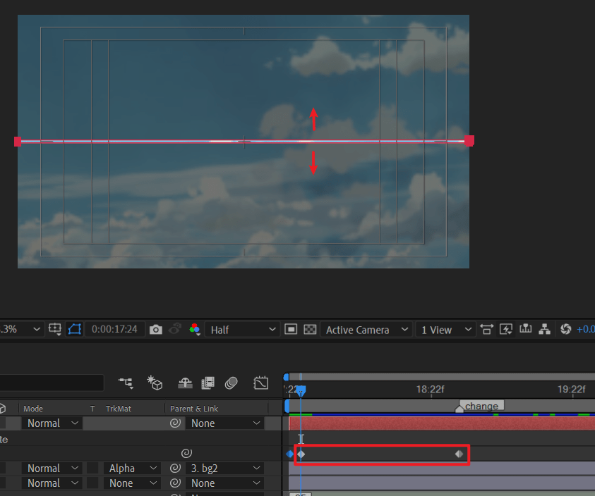

稍微调整一下运动曲线

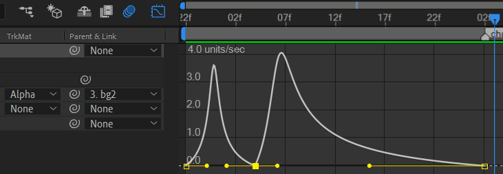

mask进入很快，然后mask展开为先快后慢。

接着，继续制作展开mask的动画关键帧。

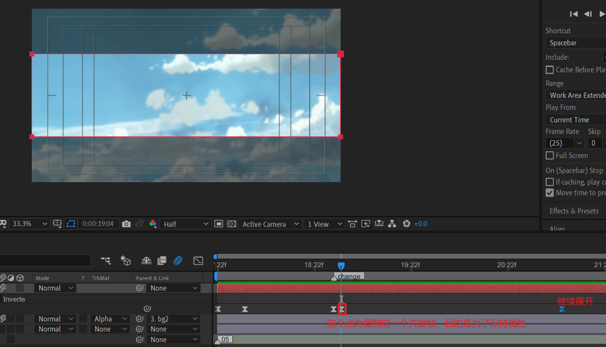

验证效果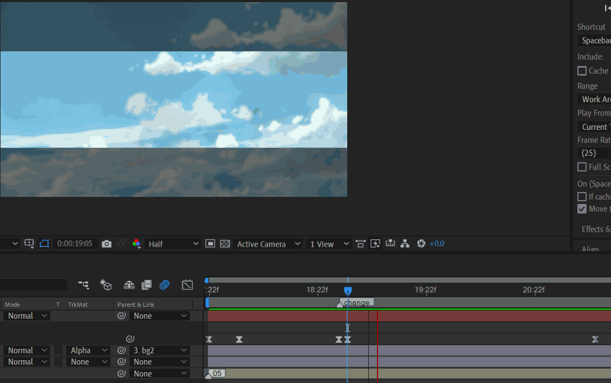

运动曲线继续使用先快后慢的模式。

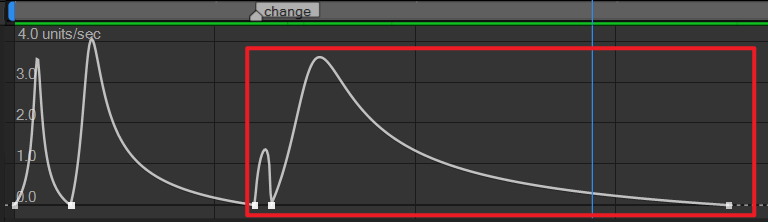

制作mask黑边。

复制matte层，命名matte-edge。设置一定的羽化。

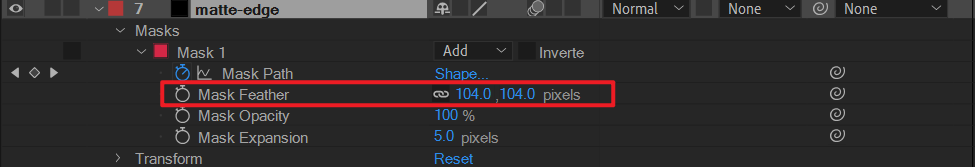

目前工程的图层如下。

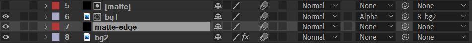

将bg1和bg2都复制一次，放于顶层。同时复制matte层。

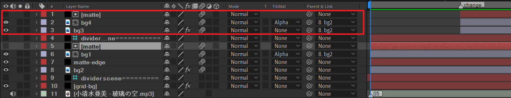

- 将bg3和bg4对齐change标记起点（音乐变化处）。
- 将matte对齐change标记裁剪掉左侧。
- 对bg3和bg4进行不透明度的K帧。前景（中间矩形）0->100%，背景0-> 30%
- 新建网格层，作为背景修饰。这里留给读者。

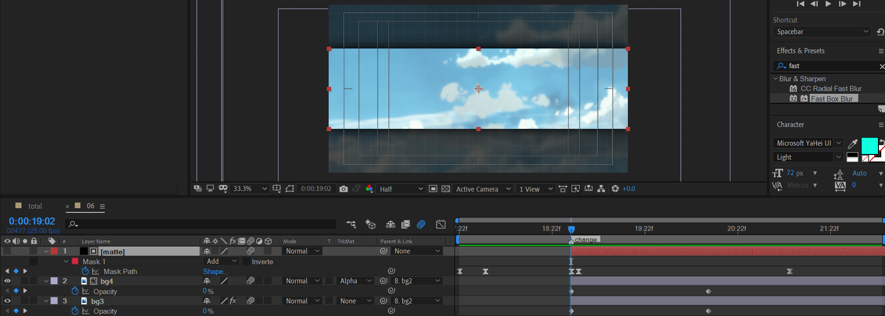

对每一处的背景应用快速box模糊以及色彩饱和度下降的调整。

预览效果。

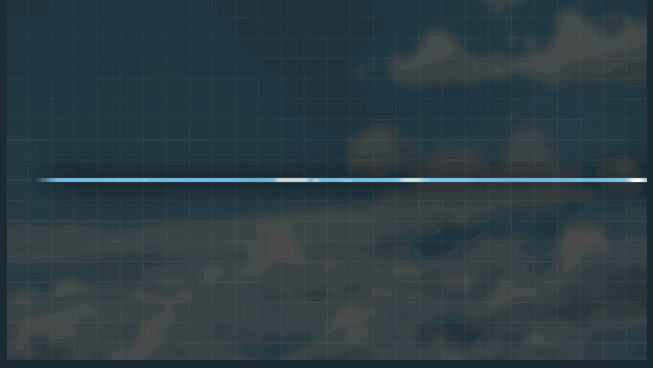

---

返回总合成final。下面处理

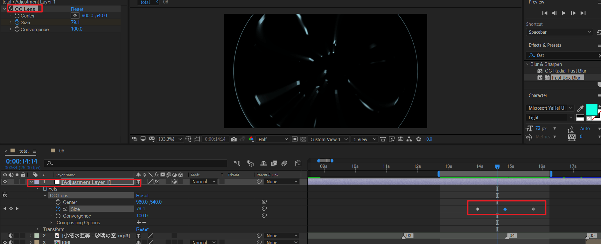

新建一个调节层。应用 cc lens效果。即一个扭曲成圆的效果。

在04合成到05合成的时间点，创建值为15的size关键帧。两侧稍微给一个250的size关键帧。附加twirl扭曲效果更好。

---

