# 0708

导入素材，开始的效果如下

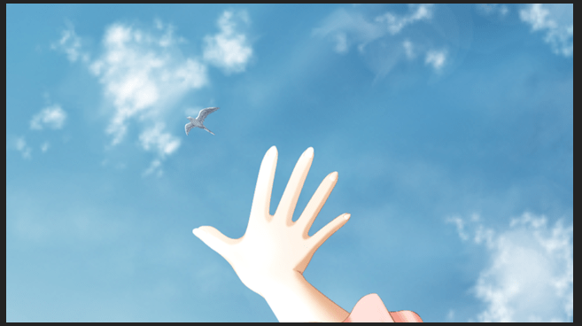

将素材空间z位置确定

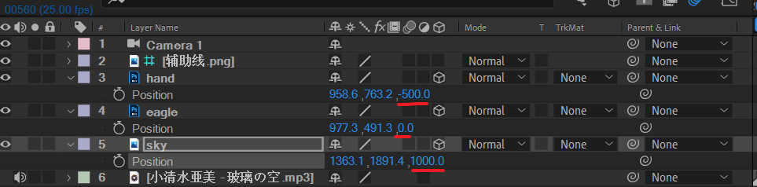

对sky背景进行position k帧。背景运动方向为从左上角向右下角运动，因为运动相对性原理，eagle看起来像飞向左侧高空。

注意调整运动曲线和打开运动模糊。

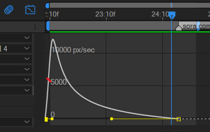

注意横轴为0，已经有了一个较大的初始速度，上面为5000左右。这是为了突出eagle的运行是高速加速飞行。

接下来制作手的展示。将锚点定于如下所示位置。锚点工具位于工具栏条。

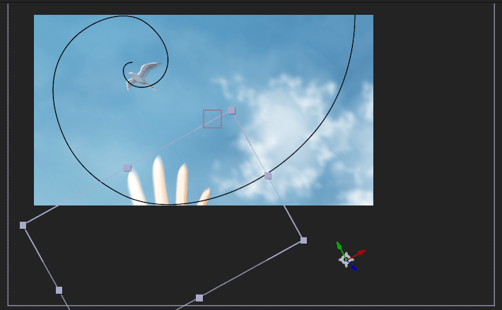

给方向值k帧。注意开始帧需要落后于sky的开始帧。因为eagle是先飞，然后再出现手。

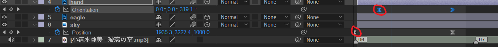

预览效果。

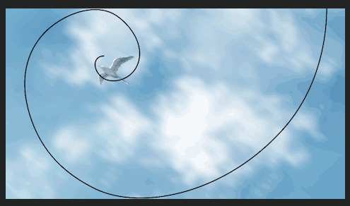

接下来，制作左上角的光。新建固态层，添加of光效，选取一个合适的即可，放于左上角。

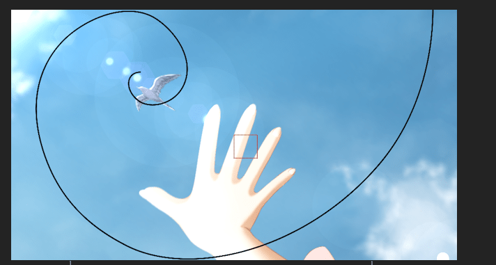

制作闪白和模糊效果。使用快速模糊和色调。

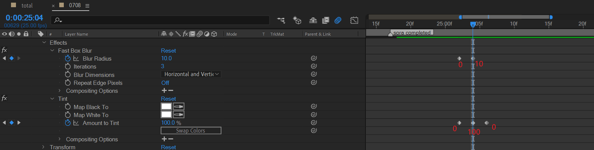

---

使用黑色纯色层创建模糊的中间矩形。

在该层新建mask，调整到合适大小。注意将inverte勾选。

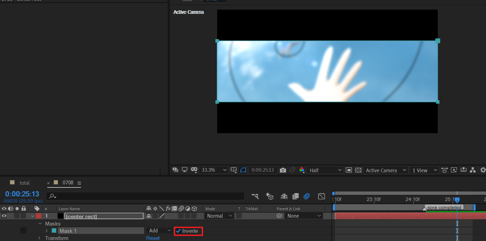

调整mask opacity将上下部分显示。

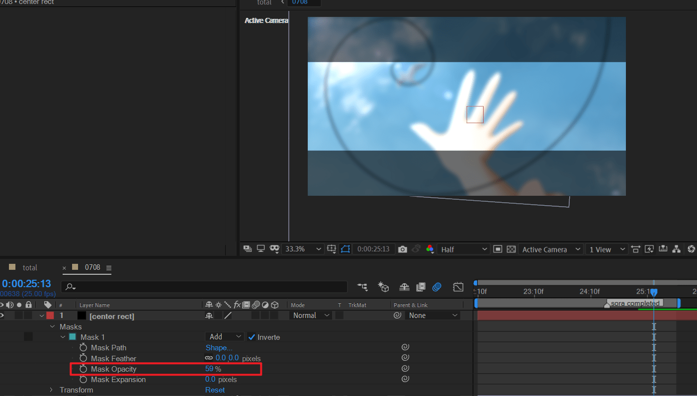

---

注意。这里的镜头移动，应该使用摄像机或者位移来控制光斑的移动(如果需要光斑移动的话）。

将人物素材导入，缩放。并思考运动模式

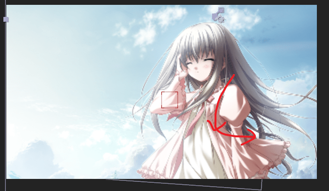

先是一个向左下角方向的位移（同时图片稍微放大一点），然后是水平向右的位移（图片恢复正常缩放尺寸）。

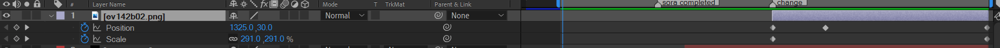

使用矩形工具，绘制四个mask矩形

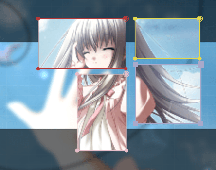

为图片人物的出现制作一个闪白，依然使用tint 0 ->80% -> 0的思路。

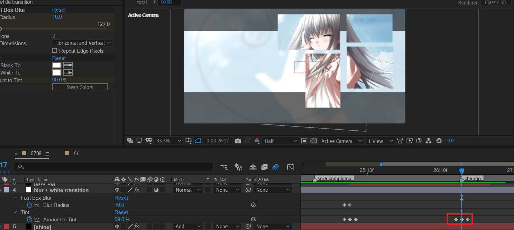

将黑色mask层打断，并调整不透明度到大约为50%

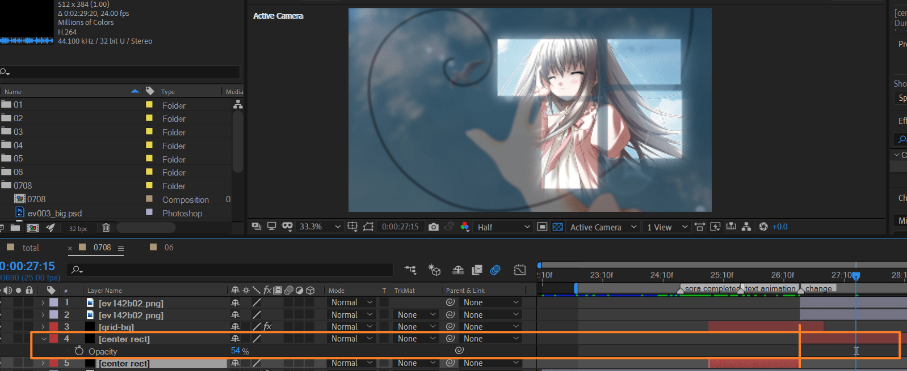

这样，人物出现时，背景就被弱化了。四个mask周围的边缘效果是mask羽化实现的。

---

添加粒子。

新建一个固态层。添加particular。调整参数如下。

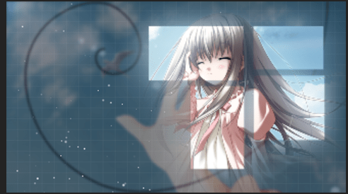

---

制作mask矩形的展开效果。

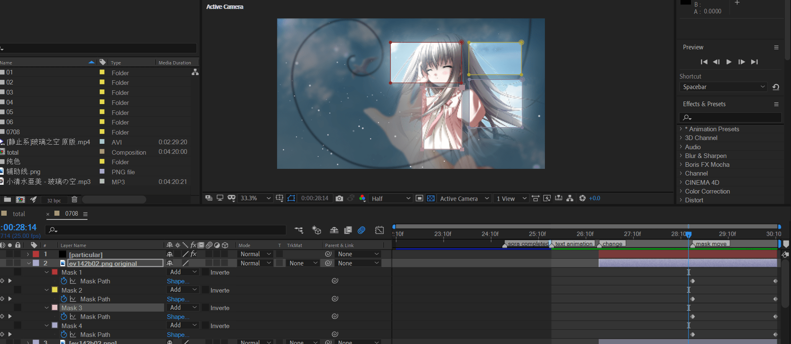

全选mask path，在展开开始时，记录初始状态。将时间指示器拉到合成末尾，将mask矩形调整为整个画布大小。

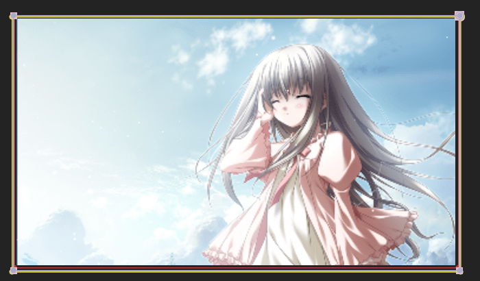

这样，动画就完成了。

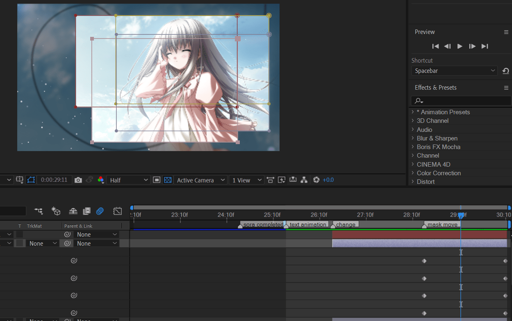

接下来，需要调整 mask的不透明度。将四个mask path的opacity改为50%

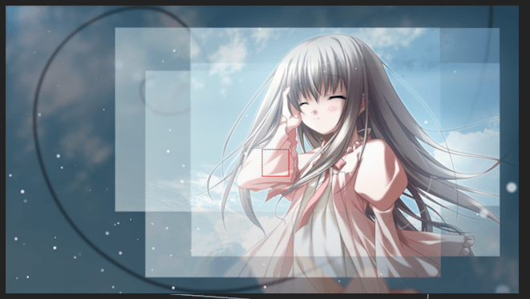

下面，制作人物的消失转场。原作效果是这样：

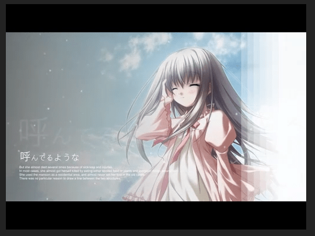

新建一个纯色层。添加梯度渐变和马赛克效果。

- 渐变：分别调整起点和终点
- 马赛克：调整水平块数量

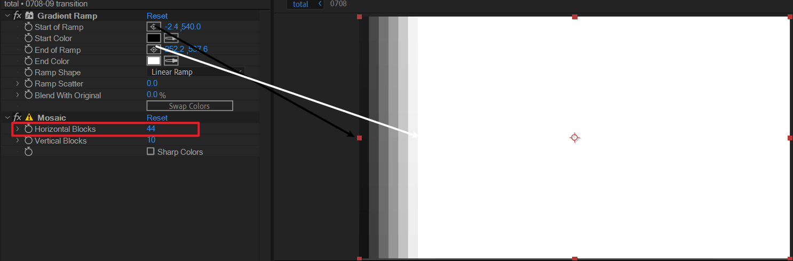

将过渡层复制一层，并对底层的复制层启用亮度matte。

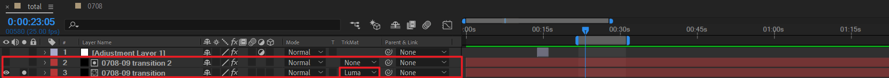

打开透明网格模式查看，效果正是想要的。

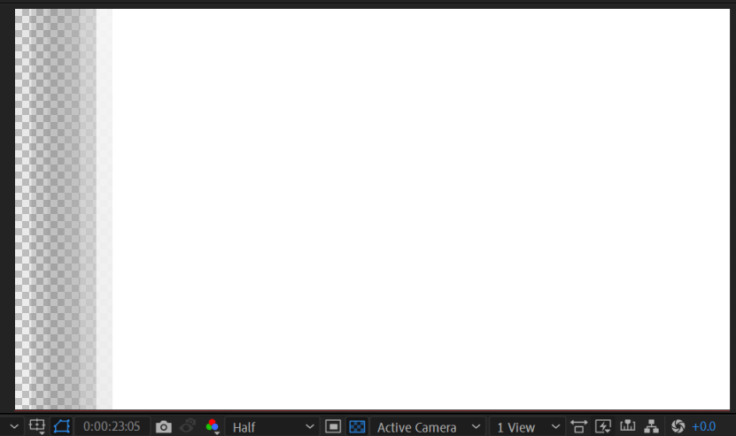

对position k帧

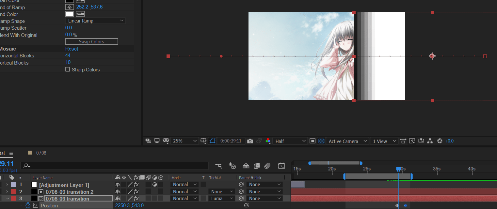

发现右侧太白，可以调整一下不透明度。

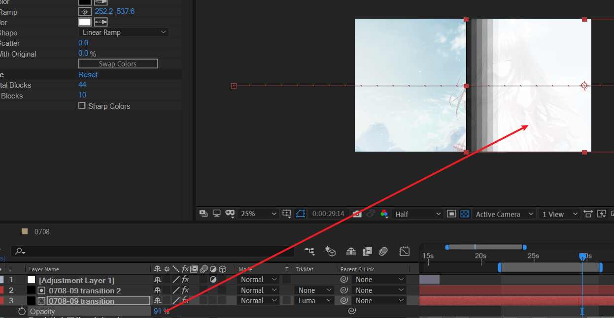

> 其他方式：采用七个白色图层，错位摆放x轴，并使用一个图层作为父级统一管理。

