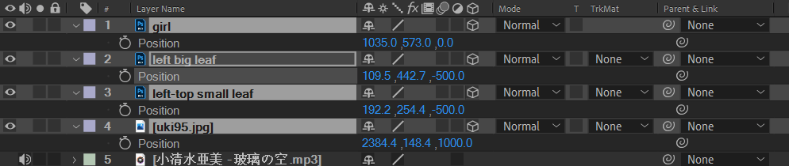
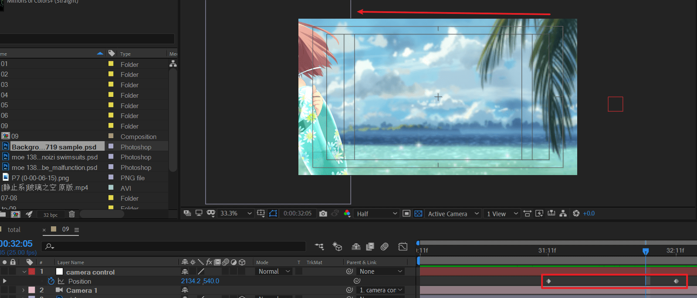
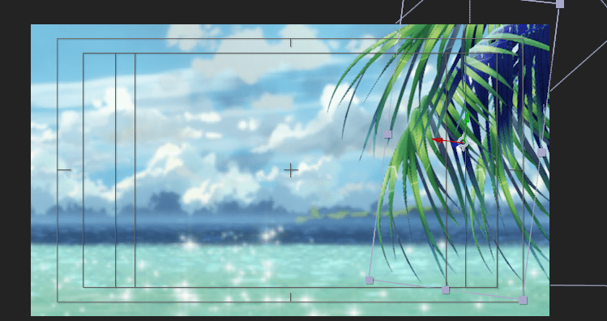
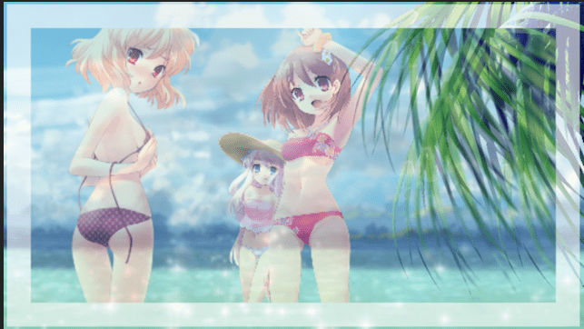
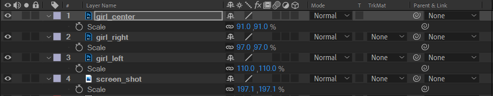
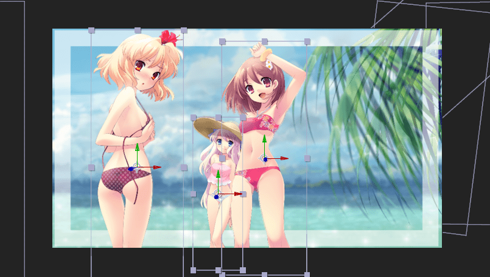
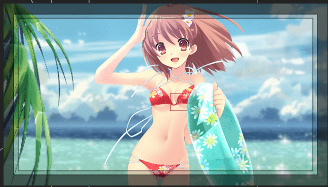

# 09

将素材依次导入，注意打开3d开关，并将背景放于z=1000,前景z=-500，人物为参考点z=0的位置。

创建摄像机，注意选取一个稍微广角的，例如28mm。并新建空对象，将摄像机绑定到该空对象。

对空对象K position的关键帧。

移动后，将叶子先摆放好。注意这个叶子需要摆成跟后面定格画面大致一样的位置和大小。

将定格素材拖入，放于当前的顶层。shift T shift S打开不透明度和缩放。先将画面缩放至合适大小，然后将不透明度调低到50%左右。

然后进行重叠对齐。

然后拖入人物素材。注意按图层导入，拆分出三个人物。

将所有人物，命名left，center，right。放于定格背景层图层的上方。逐个对齐背景的人物。图层示意图如下。

对人物图层全部打开3d开关后，全选这三个图层，将其拖到正确的位置。

> 这里的思路不好。这里是将人物逐个对齐定格背景图，使用冻结帧会更好。TODO

回到开始位置。

新建一个纯色层，画出一个矩形mask，然后应用描边效果。调整描边颜色和不透明度，调整mask的不透明度。

复制上面的这层，然后适当调整缩放，这样就形成内外边框的效果。

