# 12

裁剪音乐片段，预合成。

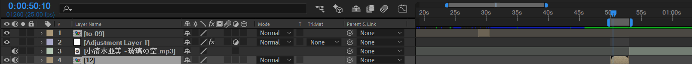

进入12合成。导入素材：背景和人物。对人物画一个mask矩形。

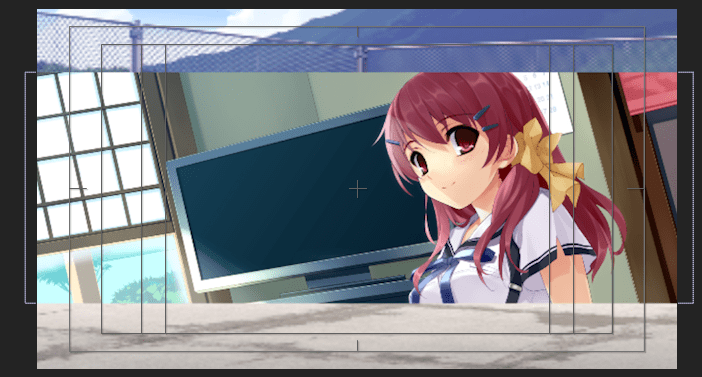

然后，对背景弱化处理。使用快速模糊和色调。

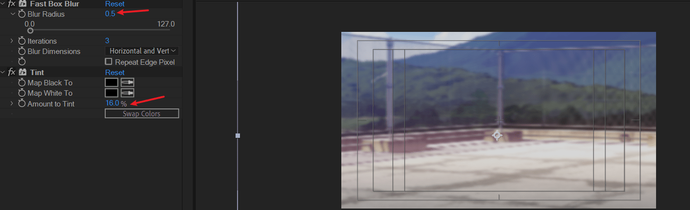

这样，背景完成了。

接下来制作人物主体。

观察原作。

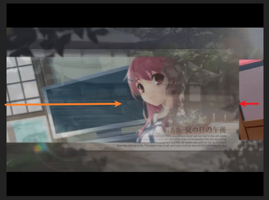

一共两层。外层从左往右，略暗；内层从右往左，略亮。

先制作外层。

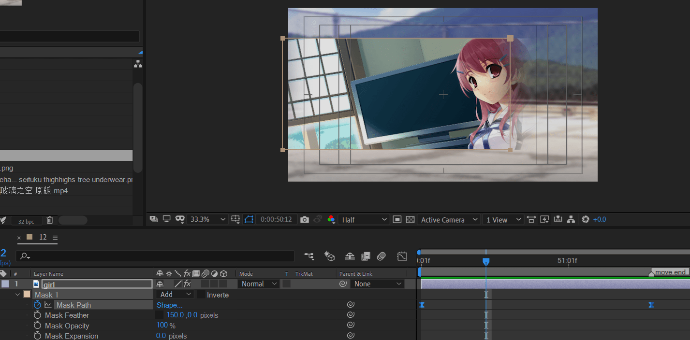

注意调整速度曲线。先快后慢。

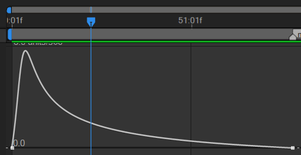

下面制作内层。先复制一层girl图层。删除原来的blur和tint效果。将mask羽化删除。将mask关键帧修改为从右往左。并将开始关键帧延迟几帧。

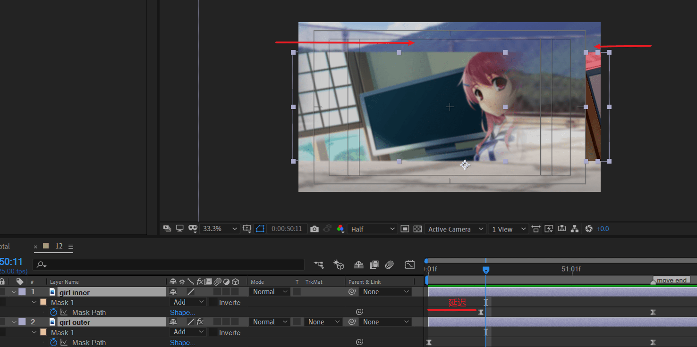

注意这里有个细节。将内层mask的扩展改为负值。参考值-20。这样，内外层就容易区分了。

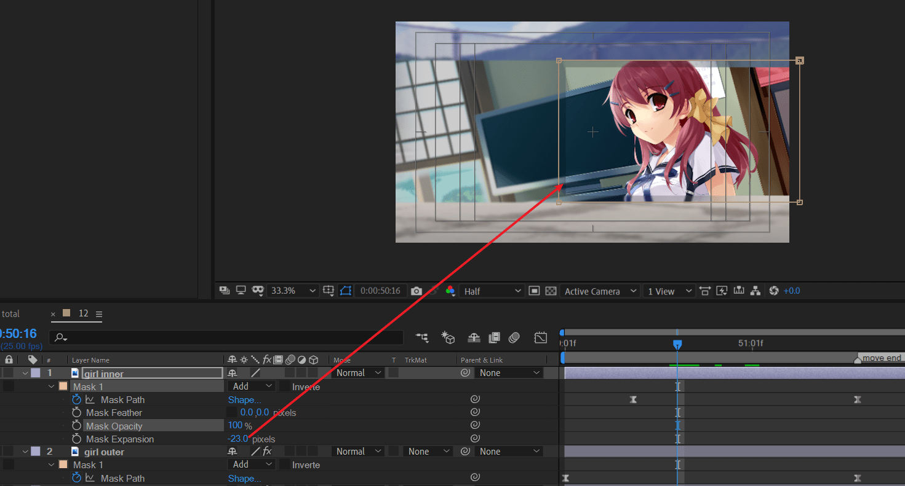

---

接着，制作人物的消失过渡。观察原作

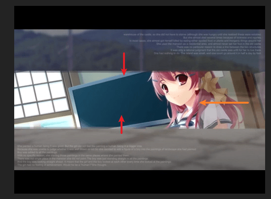

外层：向中心压缩到一条线。

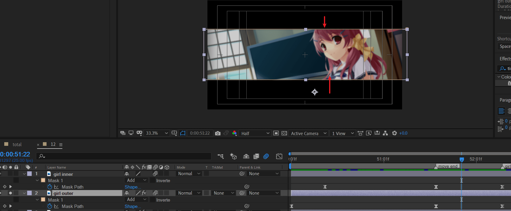

内层：mask从右往左扫过。注意将中心点改到左侧。然后将mask从右往左收回。

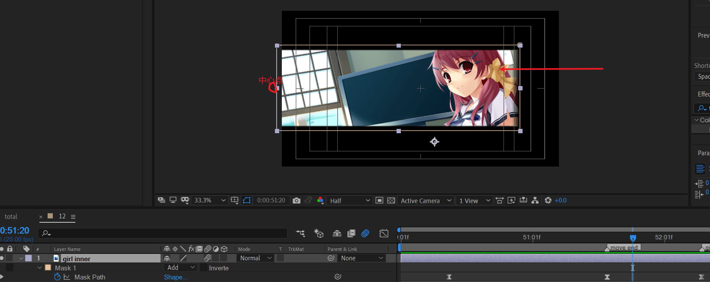

新建一个纯色层，背景白色。按住ctrl以画布中心点缩放到一条横线。并移动时间条到人物消失的那刻。

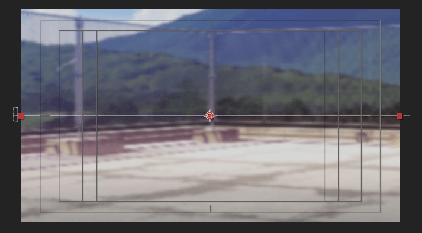

接下来，制作到下一个镜头的转场。53.00-54.00时间段。

新建调节层。并应用变换效果（transform）。对position、scale、rotation、opacity K帧。

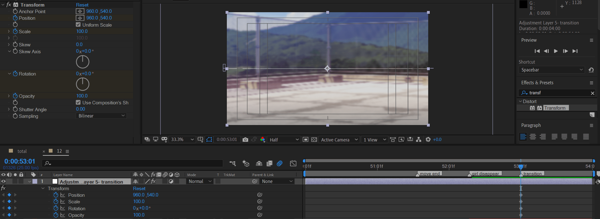

调节旋转。

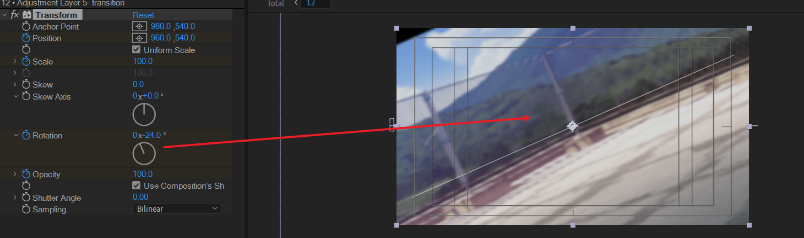

接下来将结束帧position改到左上角，同时调整缩放，opacity降为接近黑色。

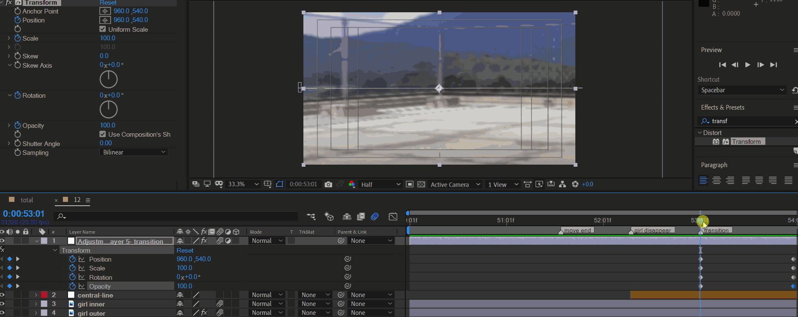