# 13

时间段：54:00-1:01:00

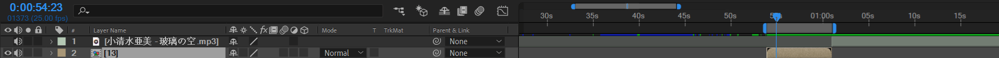

将素材导入：人物，樱花瓣，背景，草。

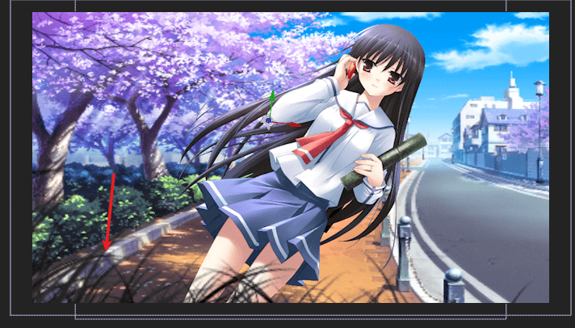

新建28mm摄像机，并打开景深。将光圈调大，这样聚焦清晰位置在人物身上，弱化背景。

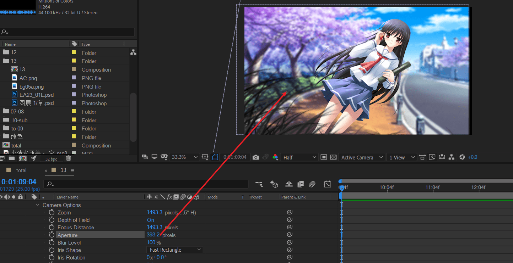

新建一个点光源图层，将position z改为0。将图层素材接受灯光关闭。

新建一个纯色层。应用of光。预设选一个有光晕的。将模式改为Add。将光源改到右上角。模式改为追踪光源。

接着，将点光源位置改为右上角云朵位置。这样，of光完全跟随这个点光源。

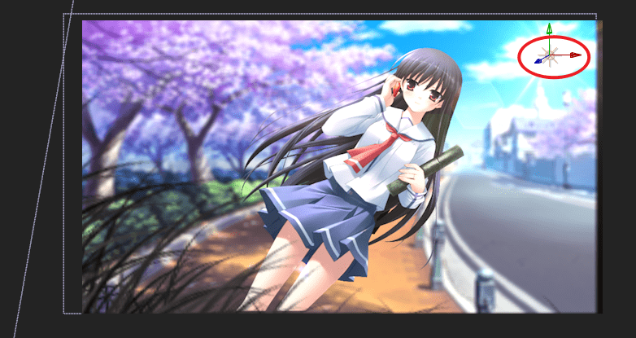

下面新建一个纯色层，应用RG 粒子，用来制作粒子效果。注意将发射起点放于左下角。

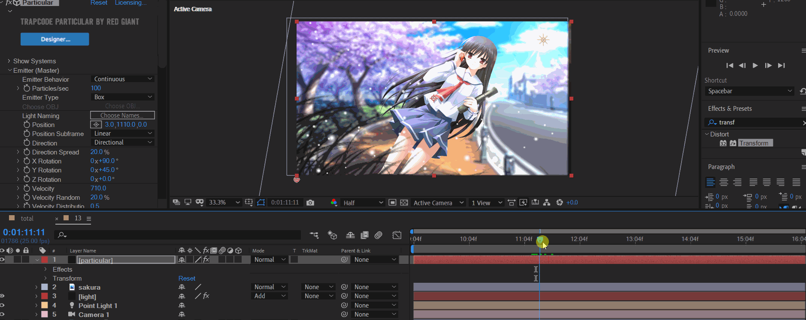

独显粒子层。

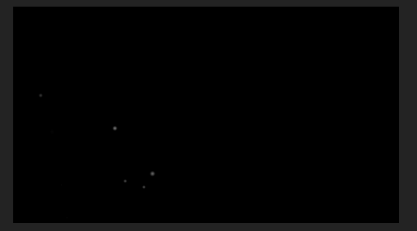

接下来要替换粒子单元为樱花花瓣。

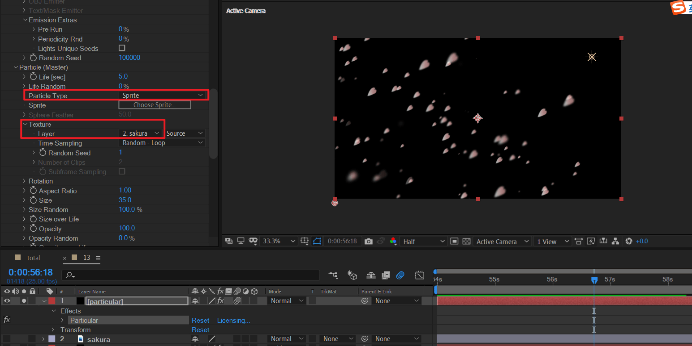

将随机旋转也打开

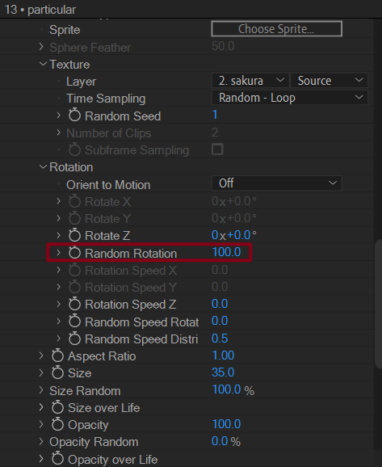

> 旋转速度随机这个选项也可以设置一个较小的值。这样，移动时，自身也会轻微旋转。

下面制作人物进入的转场。

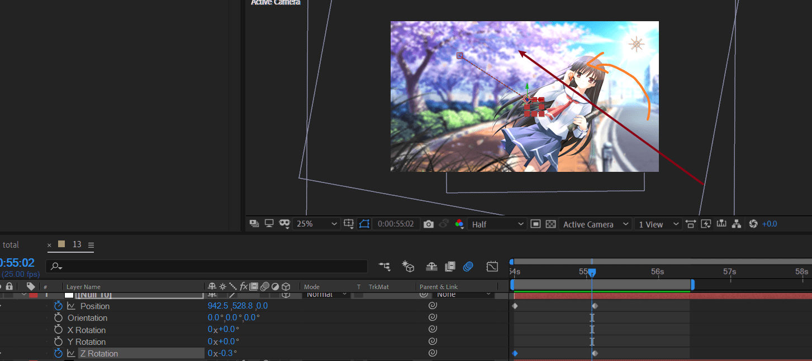

两个关键点：

- 素材从右下角移动到合适位置。（红色箭头表示运动方向）
- 同时轻微的逆时针旋转。这是为了配合这个倾斜的人物角度。

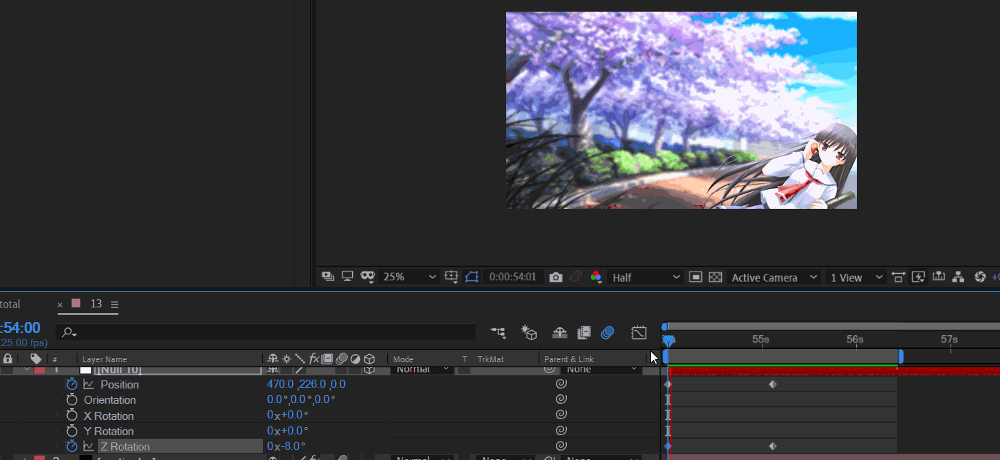

新建一个纯色层。K一个不透明度从暗到100%的渐变。这样场景进入就更加自然。

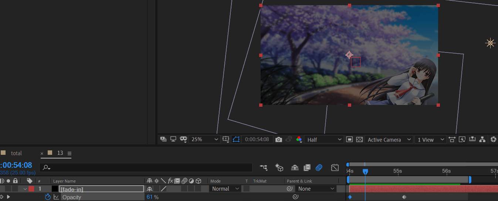

为了让动画的运动静止，在人物快速进入场景后，后续补充轻微的运动关键帧。缓慢移动+缓慢旋转。

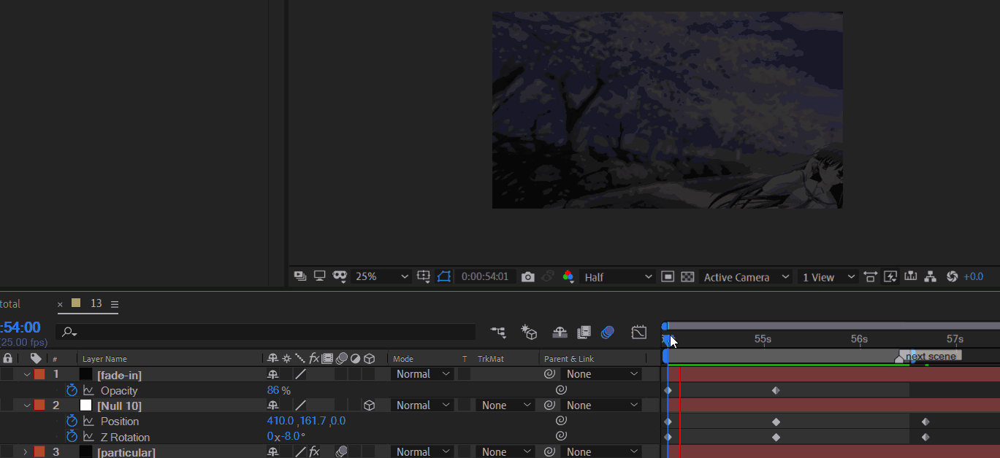

人物消失时，逆时针旋转出去。注意人物旋转中心在左下角。同时，在fade-in层K不透明度的关键帧。

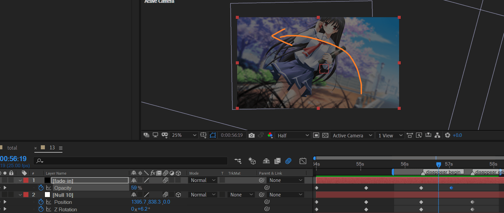

制作下一个镜头的转场

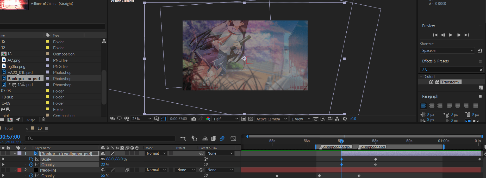

上一个镜头opacity: 100 -> 0

下一个镜头opacity：0 -> 100

这样产生了交叉叠化的效果。

之后，当前镜头继续给一定的scale关键帧，保证动画不会静止。

将第二个人物复制一层。放大。然后应用add效果。这样人物就会很亮。

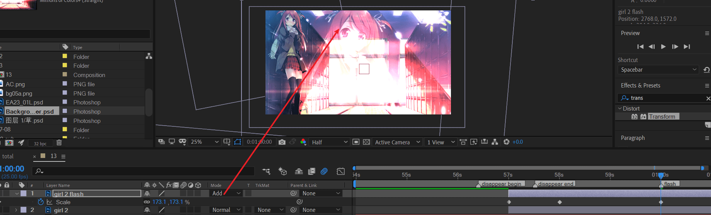

接下来：制作人物的闪动效果。这里将制作三次闪动。

1. 人物突然出现在中间稍微偏左处，然后向上运动，消失。

   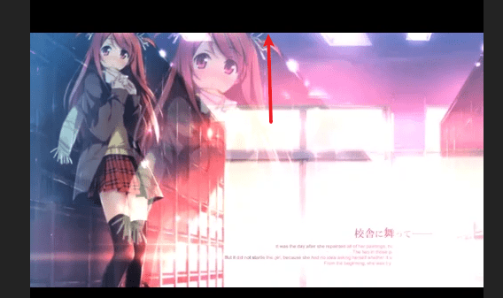

2. 人物突然出现在中间，然后向下运动，消失。

   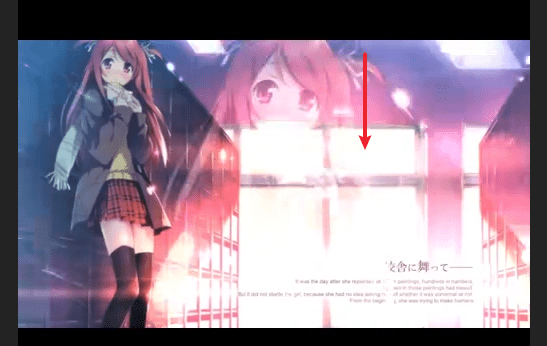

3. 人物突然出现在原图人物位置左侧，然后向原图人物位置运动，直到重合。

   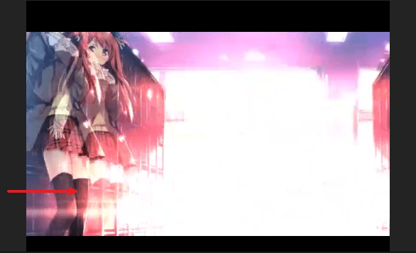

实现的时候，主要是K position和opacity的关键帧。每次闪动的时间为5 frame。

第一个闪动。

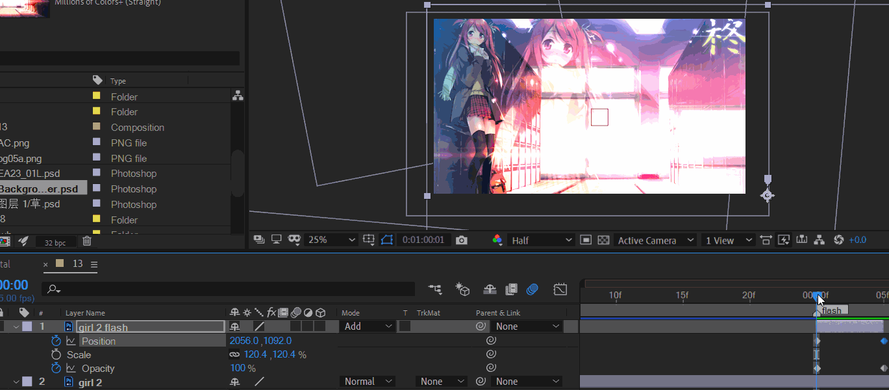

第2,3个闪动以此类推。

最终效果。

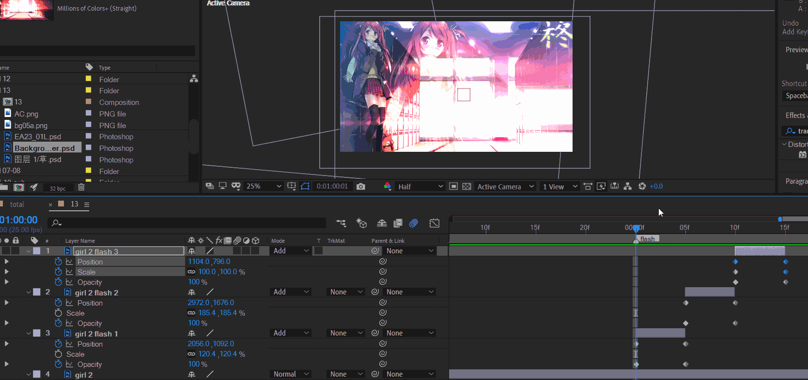