# 03
<!-- READING-TIME:START -->
>  🕛 reading time: 4 min read | 🔖 words: 798
<!-- READING-TIME:END -->

新建一个合成，背景黑色。

新建一个固态层，命名光效1。整理到03文件夹。

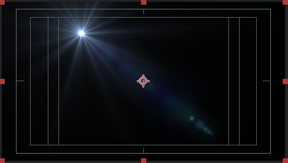

新建两个点光源，摆放位置如下

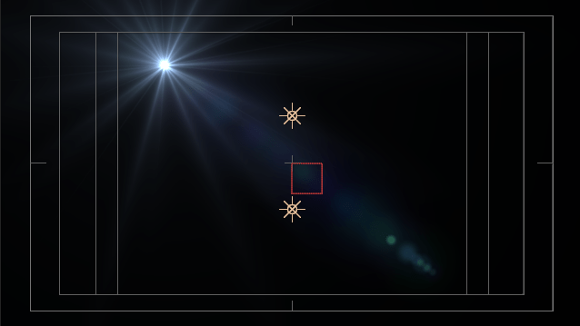

新建一个空对象，将两个点光源链接到这个空对象。然后旋转一下这个空对象的Z轴实验一下。

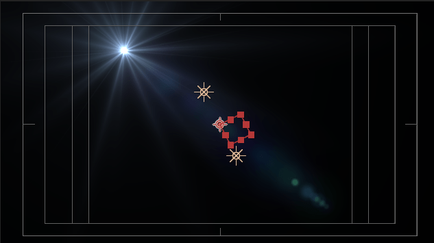

对这个null obj k关键帧，分别K缩放和Z旋转。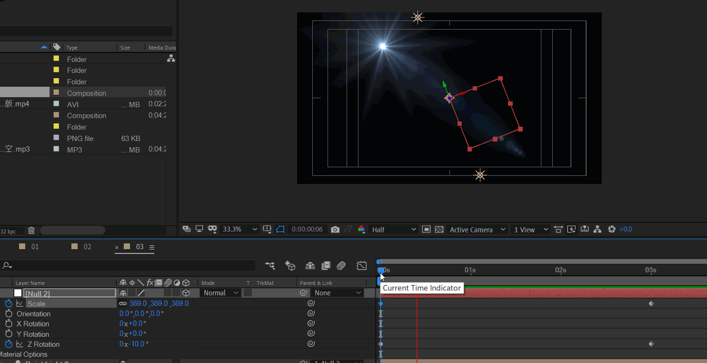

接下来，将光效层的位置模式->来源类型改为：跟踪灯光。

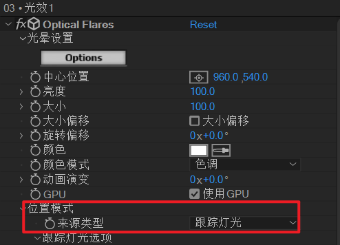

基本效果就出来了。

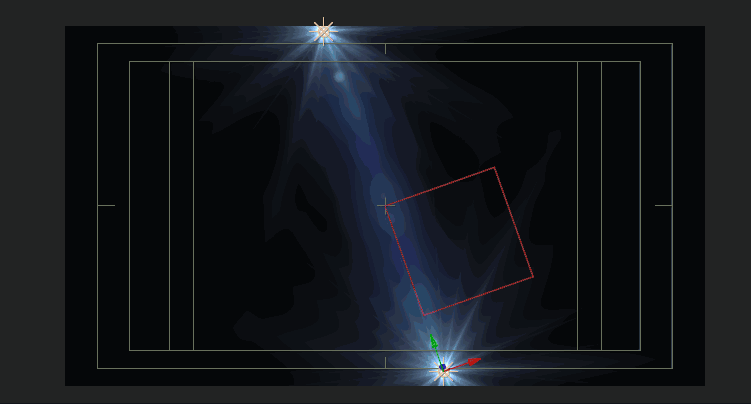

接下来，进入of光设置，主要设置：两个主光晕，背景伴随光晕（弱），颜色

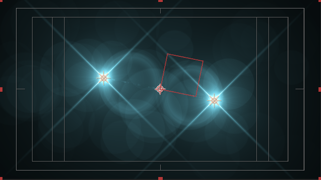

接下来，制作线条跟随扫光的效果。

新建固态层，背景黑色。应用RG trapcode particular。

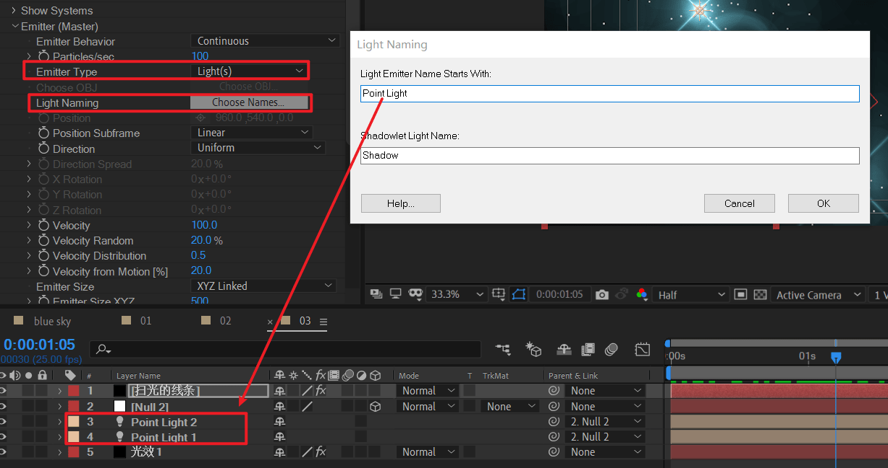

1. 首先设置发射类型为light(s)
2. 设置Light Naming为Point Light开头。

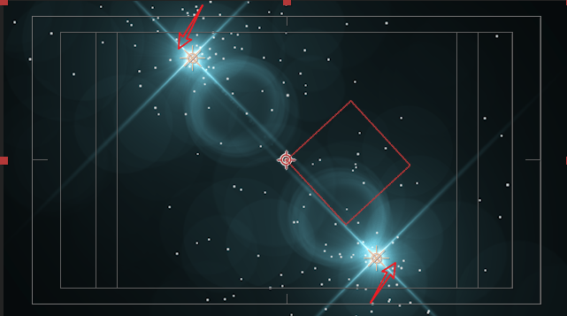

这样，粒子就跟随光源了。然后目标转化为：设置粒子的参数，使得成为一个曲线就可以了。

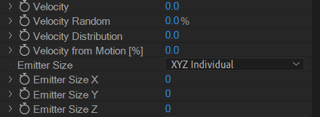

接下来，发现一个问题：曲线粗细是固定的。

为了表现出开头细，末尾粗的效果。需要调整size和size over life。即，让size随着生命周期变化。

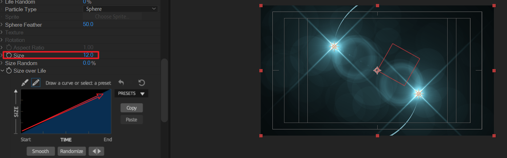

又出现一个问题，在曲线运动完成后，后续的时间段里。曲线慢慢消失了。

所以需要在曲线将要消失的前一个时刻（前一帧），冻结住。K帧physics time factor 为1.消失的那刻，K帧physics time factor 为0.

> 注意：这里建议打开空对象null 2的关键帧，方便对齐。

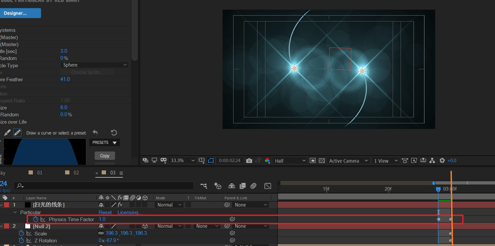

> 如果发现粒子的生命周期不够长，上图为3.0.那么可以加大到4.0.上面橙色线在3.Xs处。粒子为4s生命值足够。

复制01镜头合成的所有图层到03图层底部。并在之前03所有图层和新拷贝过来的图层之间，创建一个随意的固态层作为辅助层（隐藏掉）。这样，下面的图层可以按需删除，形成良好的工程思维。

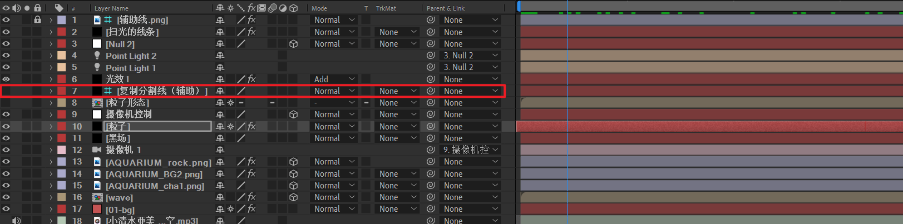

> 粒子形态注意也复制，并修复texture。

看一下，当前的效果。

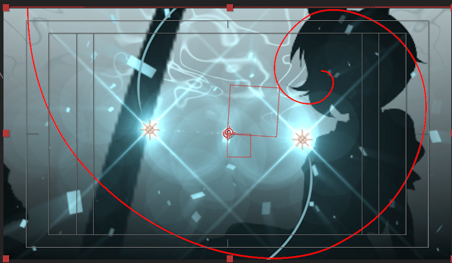

发现问题：人物，柱子，假山这些不受光。所以需要打开这些图层的受光设置。

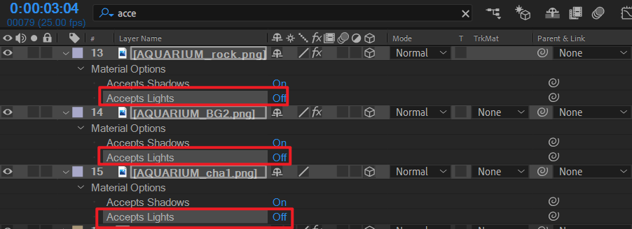

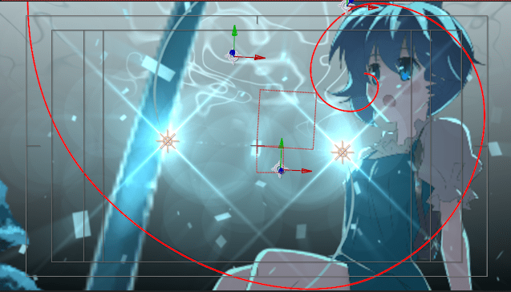


在中间位置给of光K一个亮度从100到20的关键帧。这样，光效就能消失了，进而揭示人物主体。

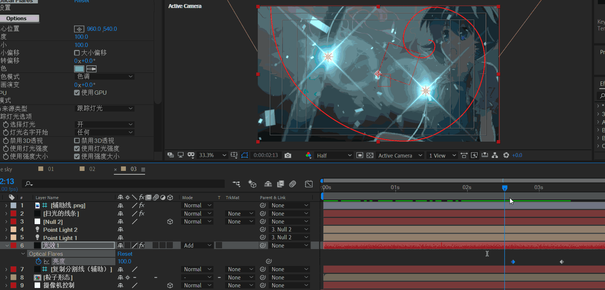

将人物，凳子素材导入，背景元素调一下色彩饱和度，变弱一点。

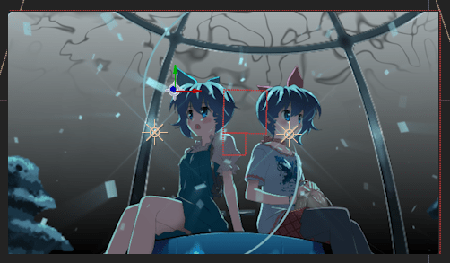

目前效果。

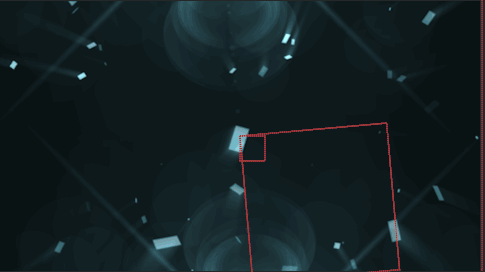

> 给曲线glow和快速box blur会更加细腻。

下面将01-03整理到总合成中，然后对齐标记点。

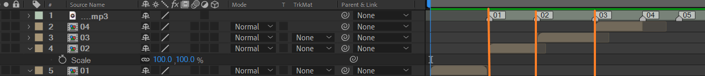

目标合成之间属于硬切的过渡。可以考虑添加透明度的渐变过渡。

下面是一个透明度的脚本ffx.源码如下：

```js
i=linear(time,inPoint, inPoint+.3, -100, 0);
o=linear(time,outPoint-.3, outPoint, 0,-100);
a=linear(time,inPoint, outPoint, value, value);
i+o+a
```

这段源码的原理先不谈。TODO

> 这个脚本意义在于平滑进场过渡和出场过渡，但是它hardcode（固定了）过渡时间，所以实际上不是很实用。
