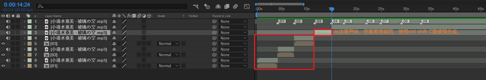
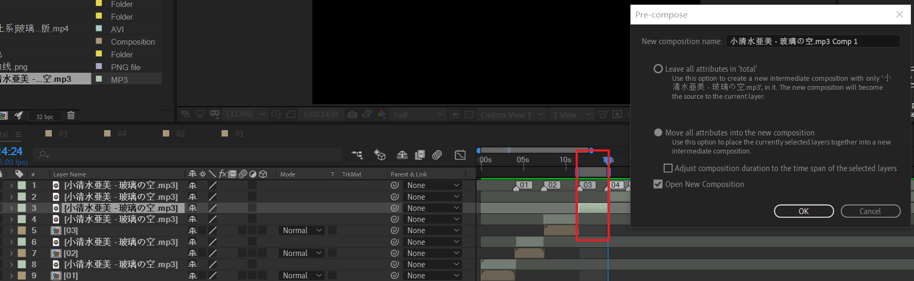
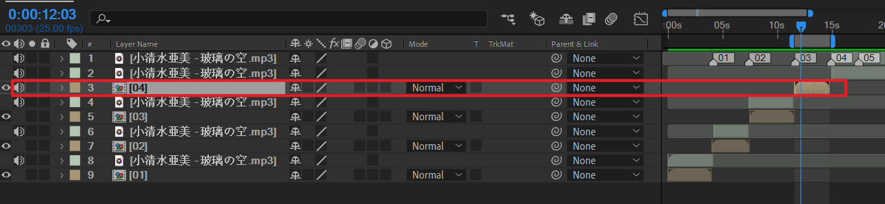

# 05 before
<!-- READING-TIME:START -->
>  🕛 reading time: 1 min read | 🔖 words: 90
<!-- READING-TIME:END -->

在做05之前，整理一下之前的01-04.

从04开始，将直接使用裁剪的audio片段直接预合成。注意工作区域要对齐audio片段。

结果如下

这样做的好处是：不再需要类似01-03这样，将audio片段摆放在合成附近。
