# 11
<!-- READING-TIME:START -->
>  🕛 reading time: 3 min read | 🔖 words: 446
<!-- READING-TIME:END -->

同样的方式，裁剪音乐，预合成。

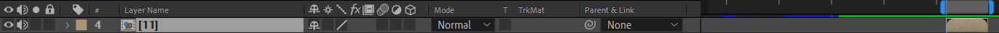

导入素材。

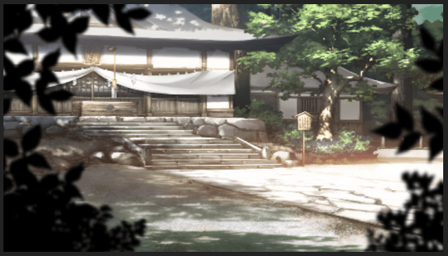

启用图层3d，创建一个28mm的摄像机，启用景深。调整高度关系如下。保证叶子在前，背景在后。

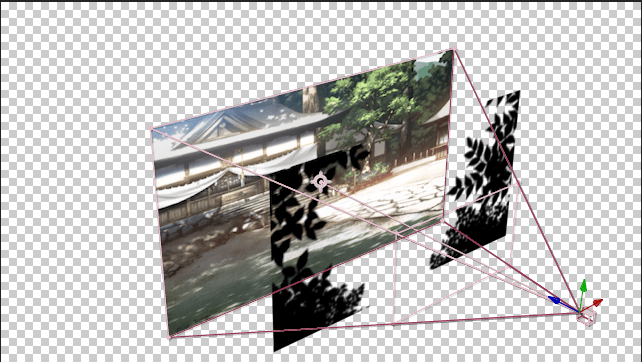

观察原作转场。是以右上角为旋转中心，顺时针旋转+缩放进入。

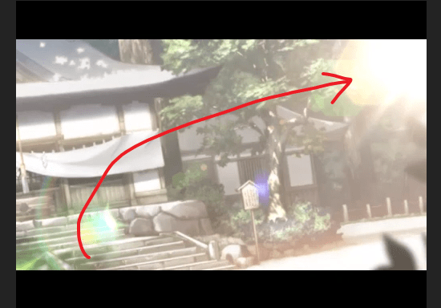

新建空对象，绑定摄像机。对position和scale创建关键帧。缩小，从右上角移动到视角中心。

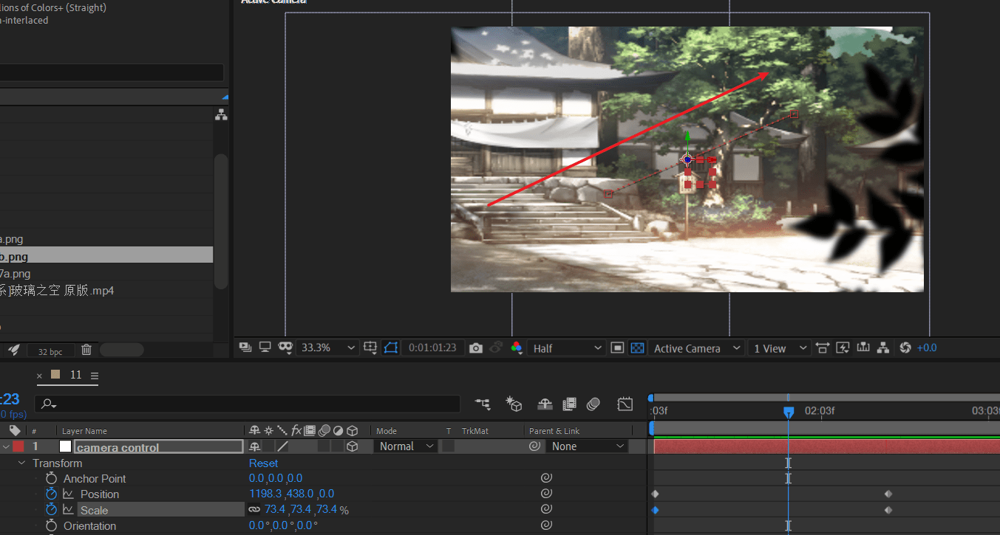

示意图如下。

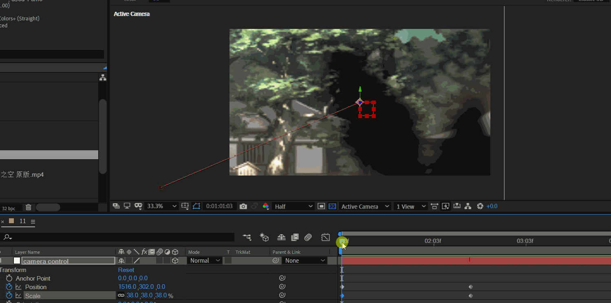

这时，同时加上一个顺时针旋转，以右上角为旋转中心。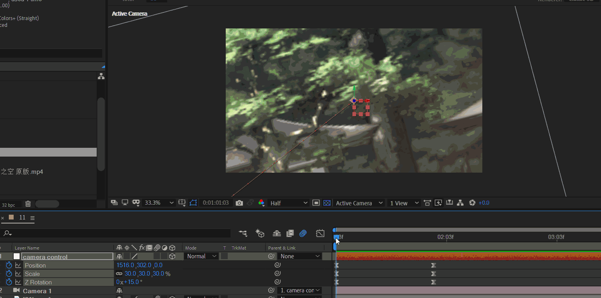

接下来，制作灯光。

新建纯色层，黑色背景。应用of效果，选择 crazy light预设。

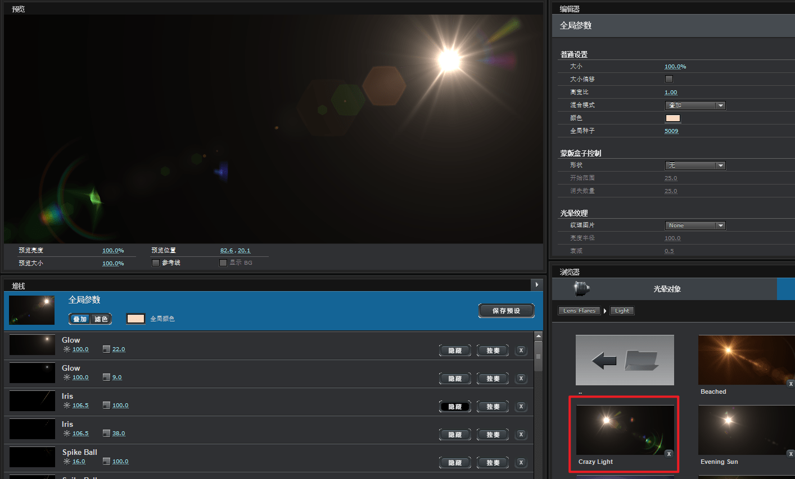

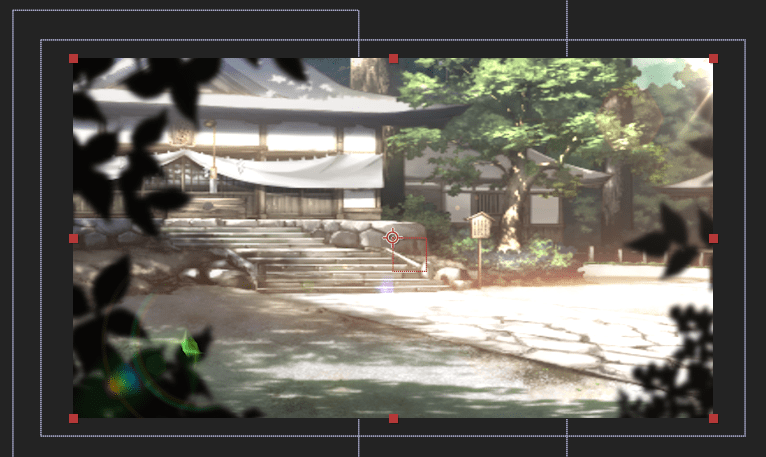

此时，of光不会跟随摄像机动画运动。下面修复。

新建一个light层。

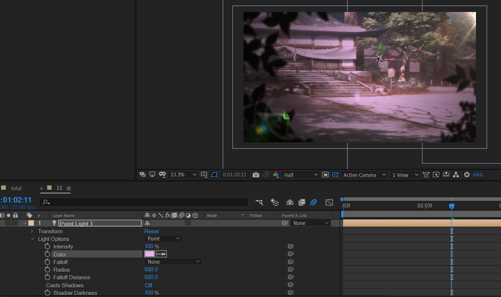

将图片素材图层的接受灯光选项，关闭。

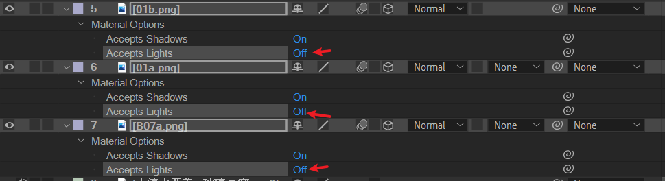

将点光源颜色改为白色。注意点光源在右上角，光晕在左下角。

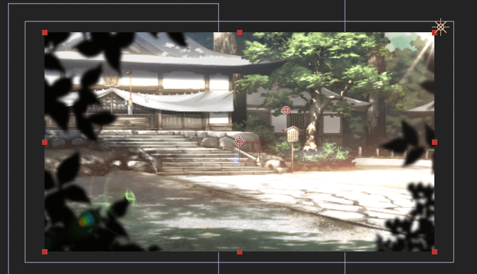

---

下面开始后续的文字出现和上下边框制作。

先创建一个调节层，放于顶层。应用fast blur。根据音乐节奏标记文字出现的时刻。

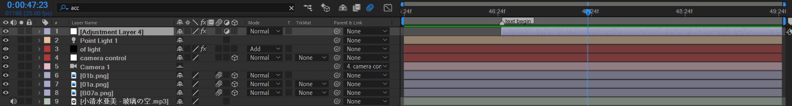

然后对该调节层继续应用：tint（色调）。将黑白映射全改为黑色。tint值改为10%。或者更大的值。

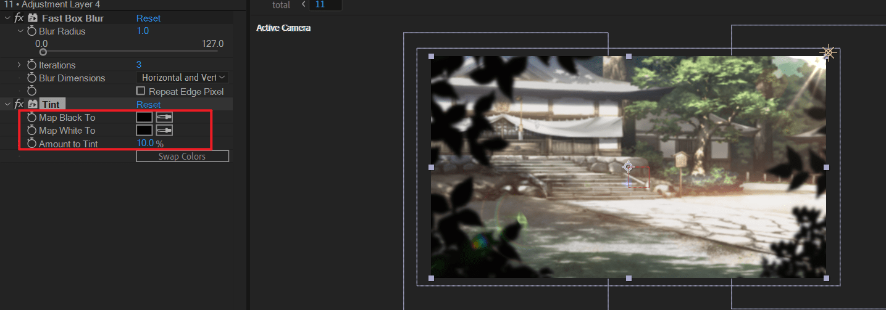

接下来制作上下边框。选中图层，然后使用矩形工具画一个中间的矩形mask。勾选invert。这样，中间亮度较高，上下较暗。

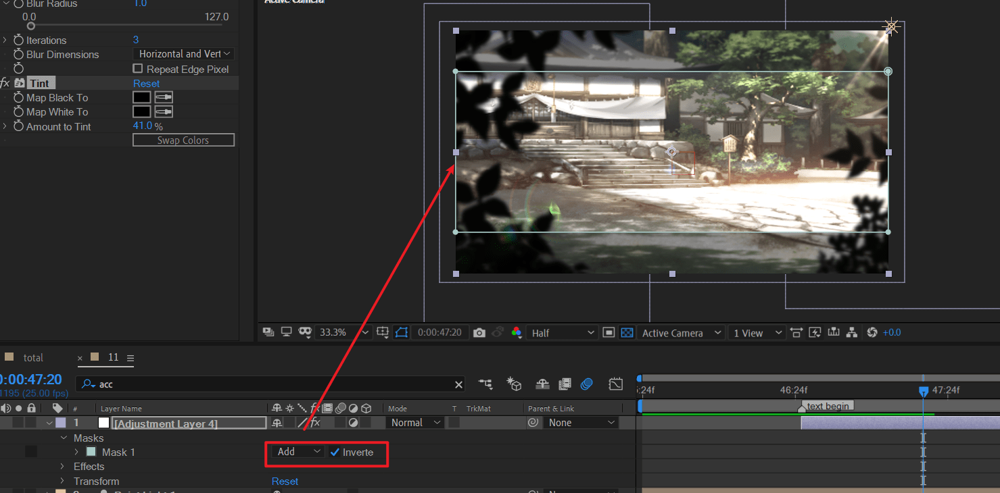

然后继续对该层，应用stroke（描边）效果。选择黑色，给一定的opacity的值。这样描边不至于太黑。

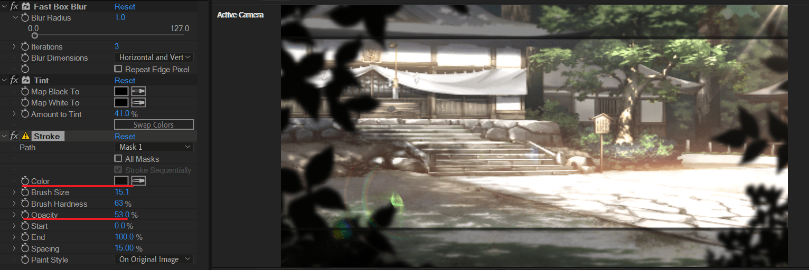

接下来，创建mask动画。先定结束帧，再将时间指示器前移，定开始帧。

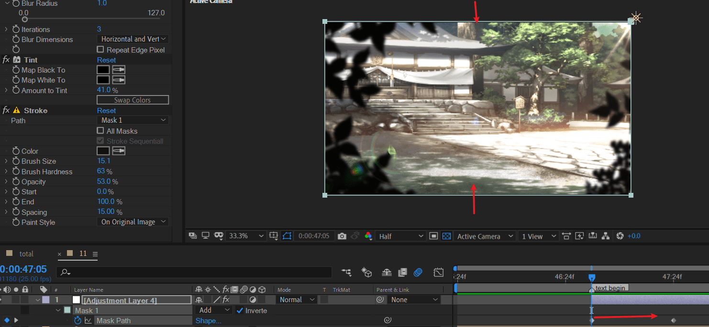

