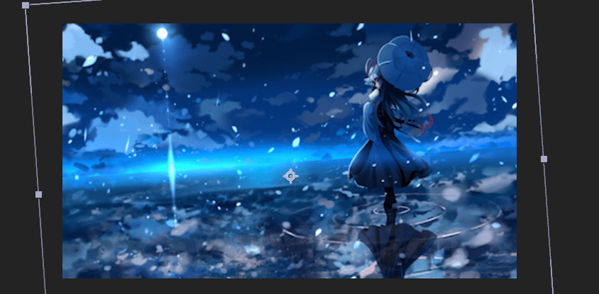
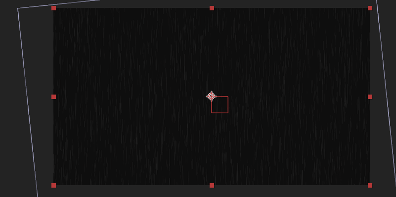
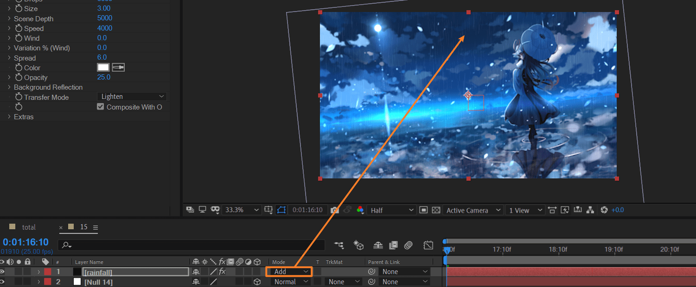
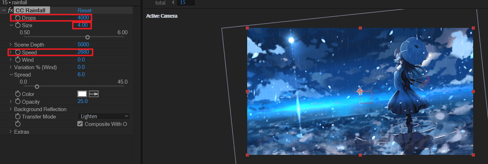
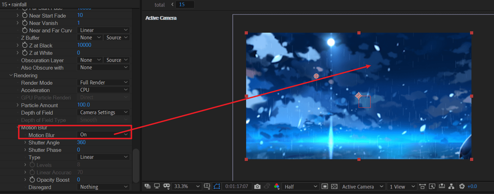
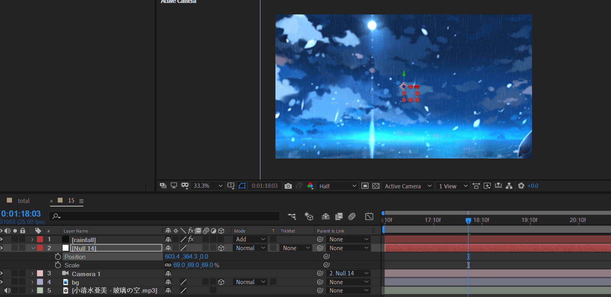
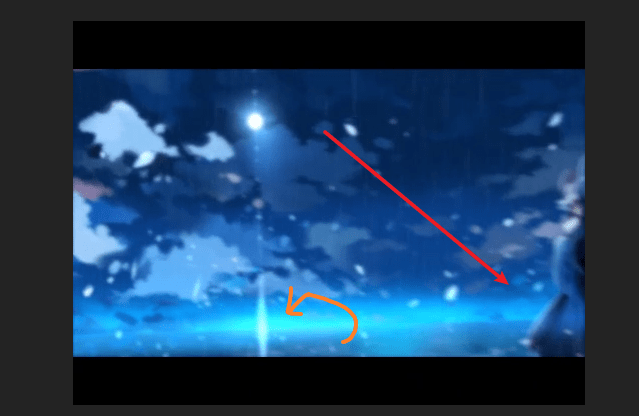
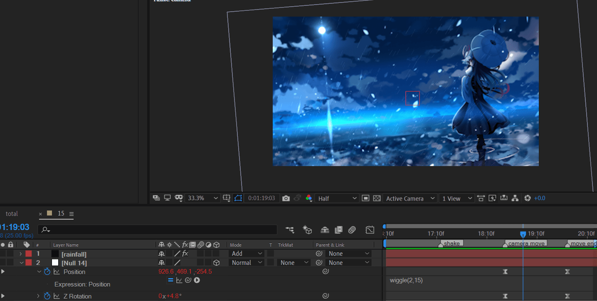
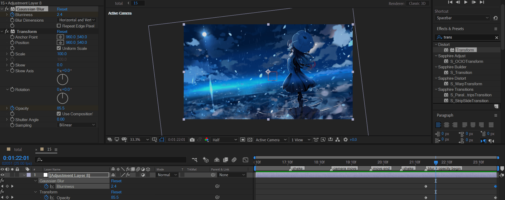

# 15
<!-- READING-TIME:START -->
>  🕛 reading time: 2 min read | 🔖 words: 278
<!-- READING-TIME:END -->

1.16:10-1.24:00

导入背景素材。



新建摄像机（28mm）和空对象，绑定摄像机。

新建黑色纯色层。应用 CC rainfall。可以看到下雨的效果。

> 注意：cc rainfall只能2D，如果需要3d和摄像机集成，考虑使用RG particular



将该图层模式改为叠加add



---

调节一下rainfall的参数



删除CC rainfall效果。改为应用RG particular效果。

改为单向，box发射，加大发射速度到700左右。应用motion blur。这样才会有拖影效果，形成下雨效果。



---

调整空对象的参数和上图对应。



---

摄像机移动，同时逆时针旋转很小的角度。





注意对position添加表达式

```js
wiggle(2,15)
```

第一个参数是频率，第二个参数是幅度。

接下来是背景逐渐消失的转场。采用调节层来控制，调节层对它以下的所有可见图层都有调节作用。



新建调节层，应用高斯模糊和变换。对模糊度和opacity k帧。
