# 16
<!-- READING-TIME:START -->
>  🕛 reading time: 4 min read | 🔖 words: 679
<!-- READING-TIME:END -->

1.24:00-1:31:00

导入素材，确定定版画面

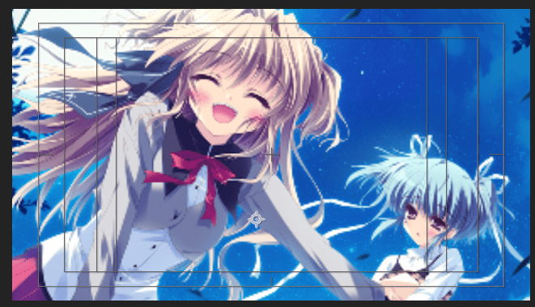

观察原作

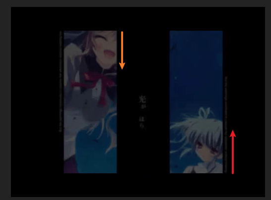

左侧矩形向下运动，右侧矩形向上运动。

使用形状层画两个对称矩形作为mask

> 不直接使用mask是因为使用mask需要预合成。

运动静止后，揭示出来的完整画面就是之前调整的定版画面的位置。这个构思非常关键。否则会出现画面不协调的感觉。

刚开始：

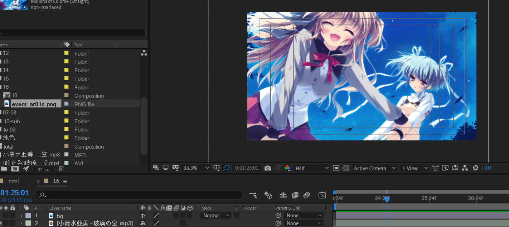

将bg复制两层，为bg left，bg right，分别对应左侧矩形mask和右侧矩形mask。

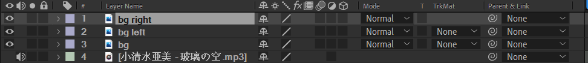

在不选中任何图层的情况下，使用矩形工具绘制一个矩形，作为mask。

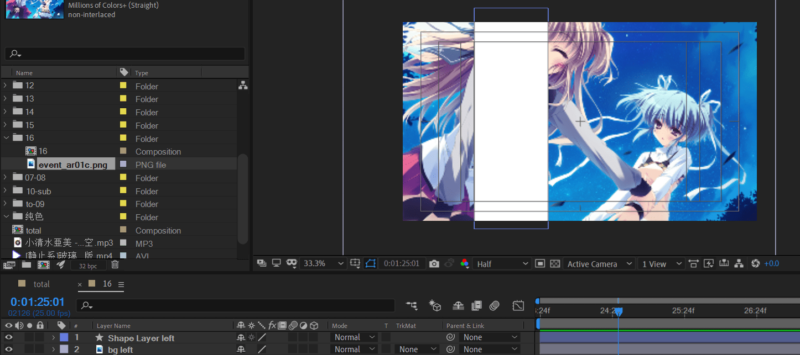

并修改名称为对应作用。

将shape Layer left复制位shape Layer right，这样保证了两个mask大小相等。并调整图层位置如下

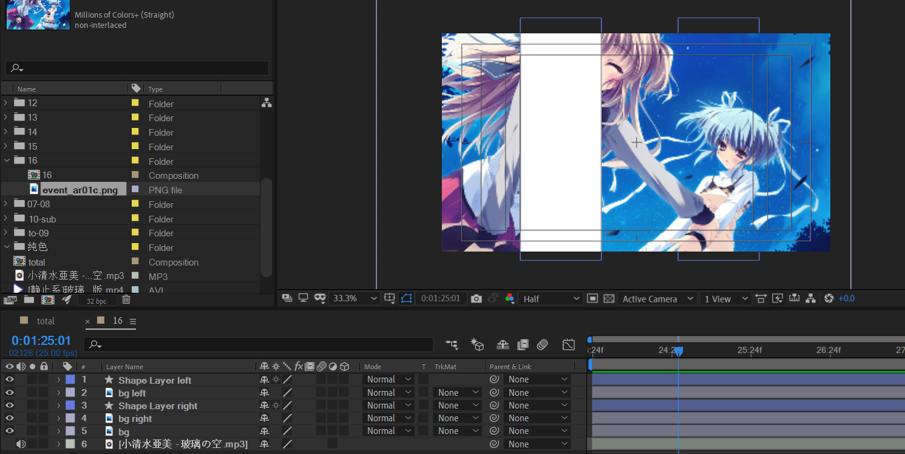

使用alpha TrkMat

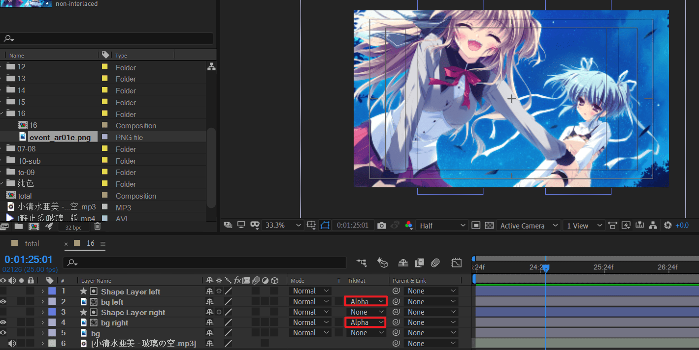

关闭bg这层，进行观察

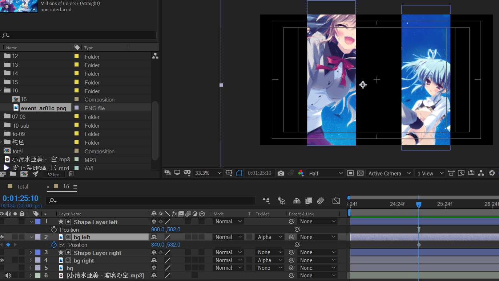

由于左侧是向下运动，因此K帧时需要将开始帧上移。

由于右侧是向上运动，因此K帧时需要将开始帧下移。

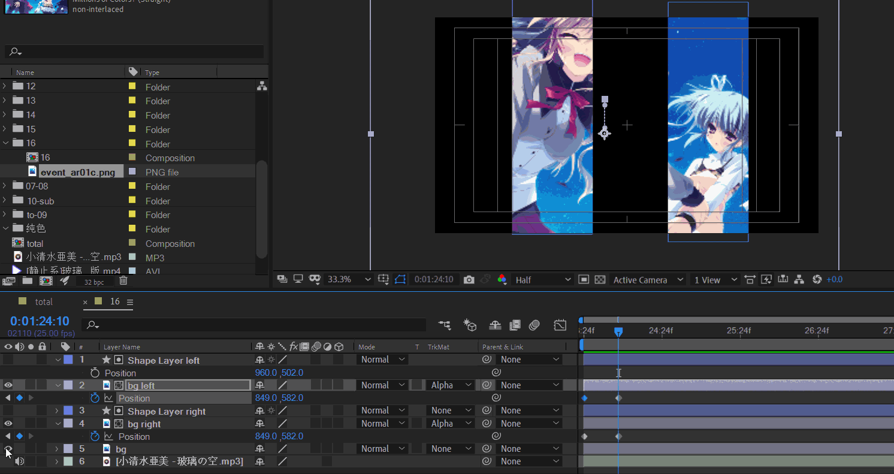

补充opacity：0-> 100关键帧

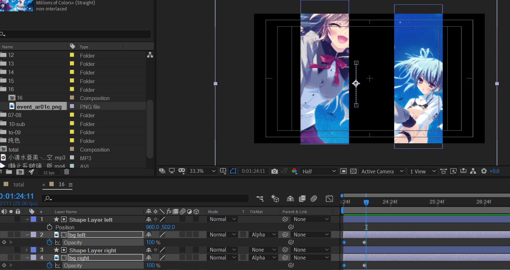

将bg图层放于目前顶层，并将调整时间轴位置。

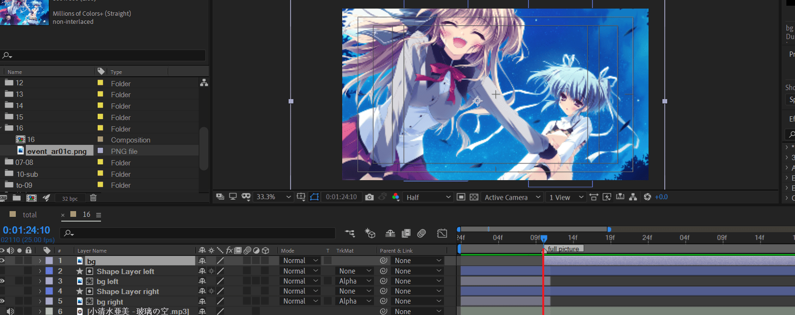

红线处的过渡。原作使用的猜测是发光和轻微扭曲，分别使用glow和CC lens实现。

> 但是还有一种人物的轻微视觉重叠，这里暂时不清楚如何实现。标记TODO

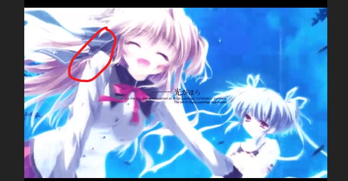

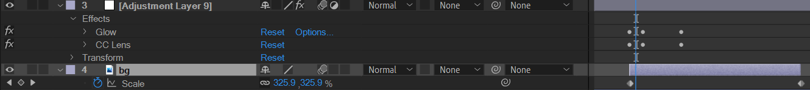

---

导入素材

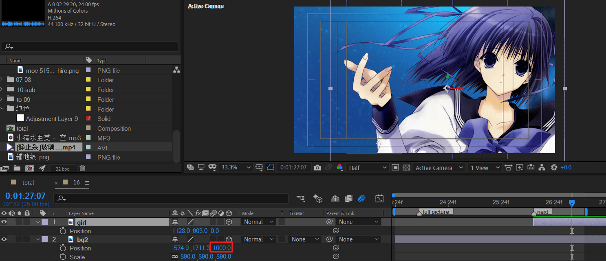

上辅助线

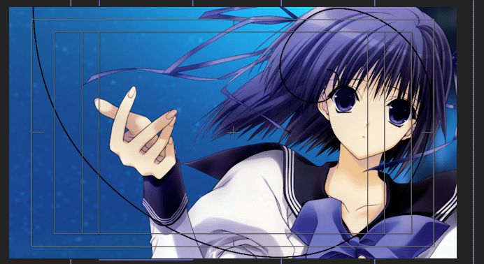

摆位置，右侧框是人物。

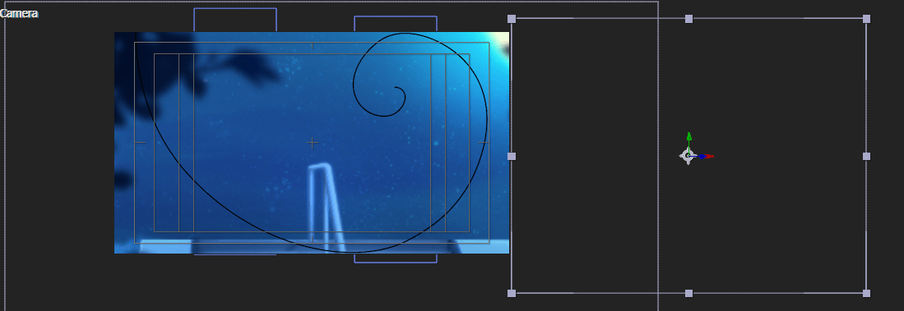

对空对象 k position

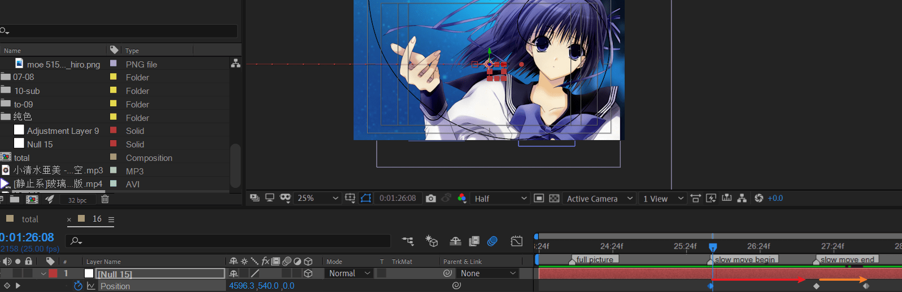

红色箭头是缓慢的右移，距离很短；橙色是快速的右移，距离很大。

> 注意，这里需要将空间-插值从自动贝塞尔改回线性，否则移动会出现诡异的左右横跳。

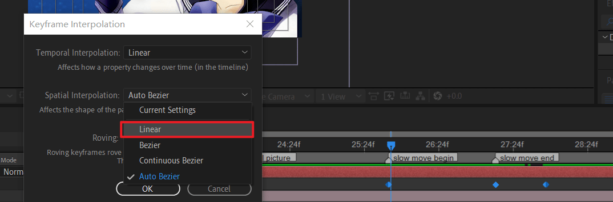

预览效果

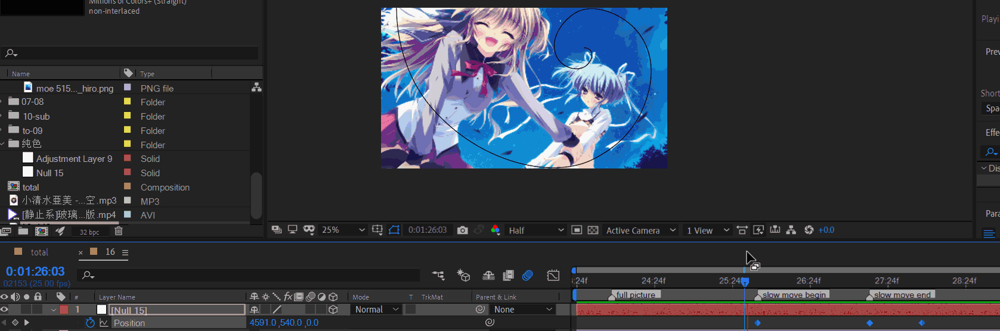

现在处理这个镜头和上一个镜头的衔接。

属于交叉叠化渐变。并且画面整体人物轮廓稍微闪一下。

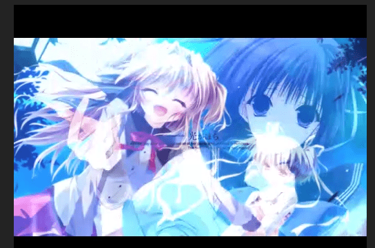

操作

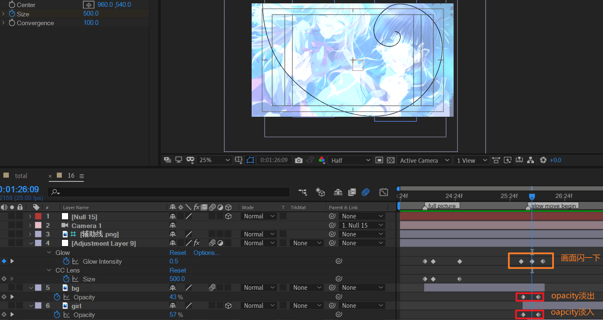

下面处理镜头右移时的运动曲线。第三段：

- 粉色箭头表示缓慢移动，保证位移不停止。

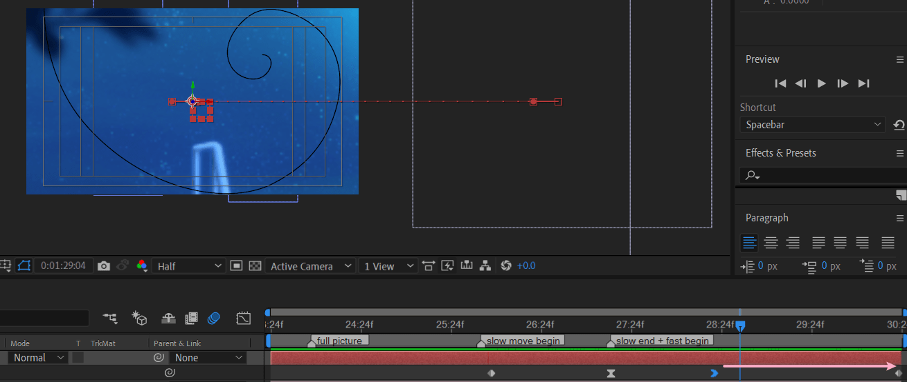

运动曲线

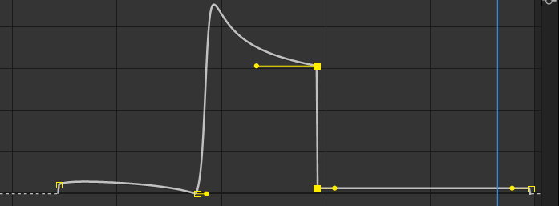

---

制作文本框

创建形状层，添加矩形和填充。使用钢笔工具绘制上面的横线，去掉线的填充，保留线的描边。

对横线使用中继器，副本为2，x偏移0，y偏移往下。

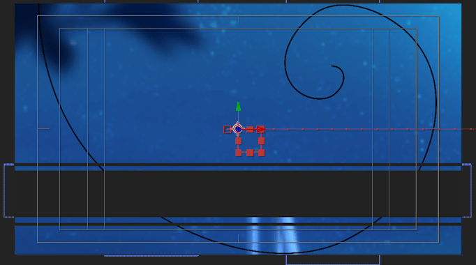

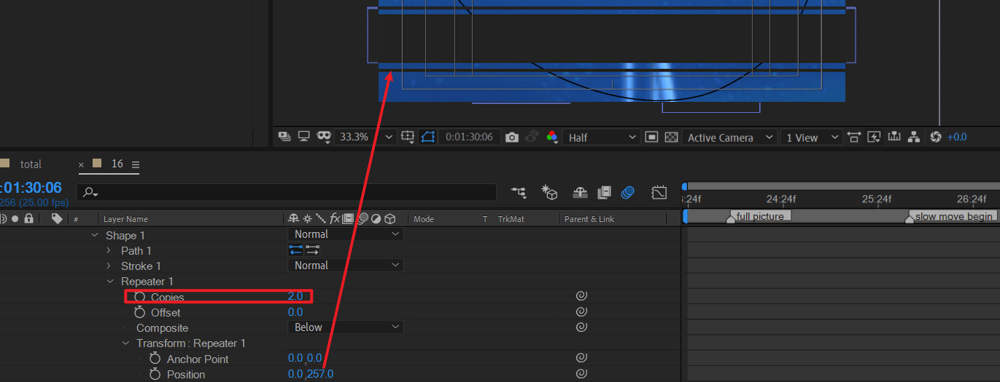

调整合适的oapacity

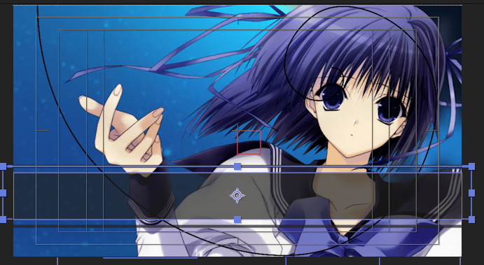

注意：这里有个文本框颜色改变的动画。详细描述：

- 白底，黑字

  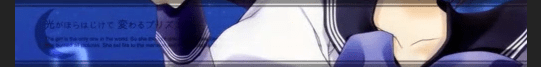

- 黑底，白字

  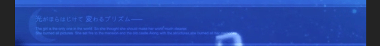

含有一定的不透明度。可以使用色调调节文字颜色，k帧。
