# 17
<!-- READING-TIME:START -->
>  🕛 reading time: 2 min read | 🔖 words: 364
<!-- READING-TIME:END -->

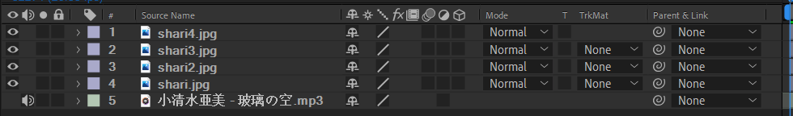

将后续三个图片绑定到第一个图片

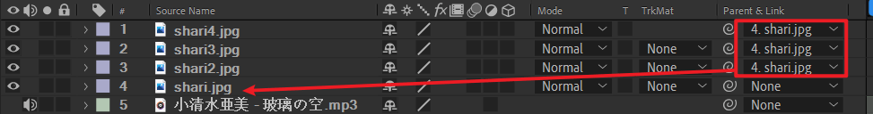

适当缩放第一张图片

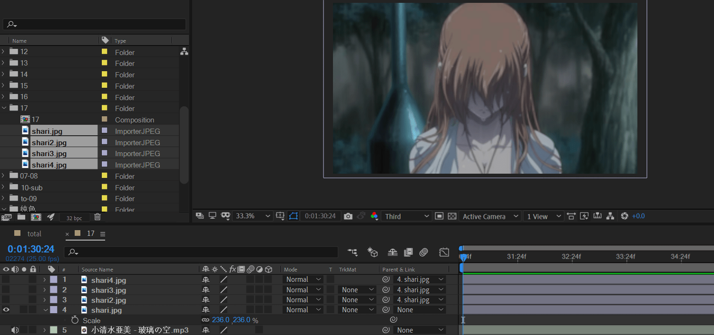

确定图层出现顺序

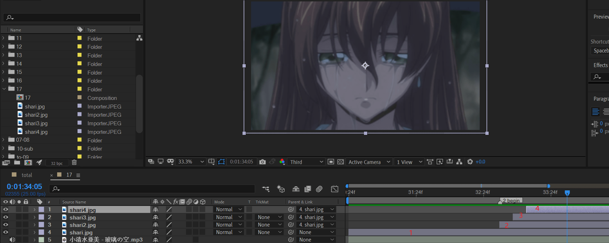

制作丝滑过渡

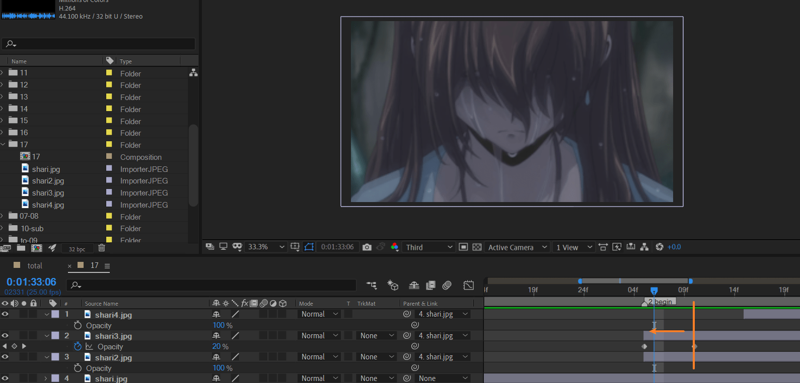

以第3图片为例。原本出现的位置为橙色竖线处。

将时间条左扩展到对齐图片2，然后k帧：opacity 0 -> 100.

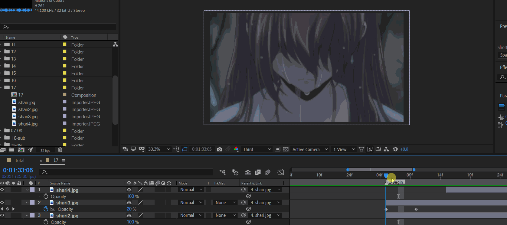

对2,3,4的图片过渡使用相同的方式

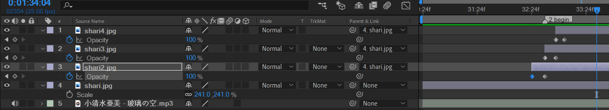

对第一个图片应用position的表达式

```
wiggle(2,20)
```

新建一个调节层，放于顶层，应用fast blur 和 cc rainfall

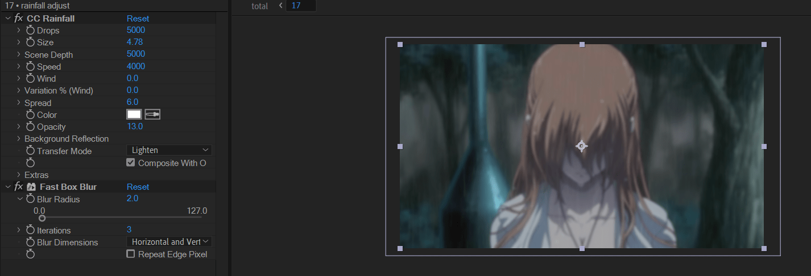

> 优化：在画面切换到近景时，加大模糊度
>
> 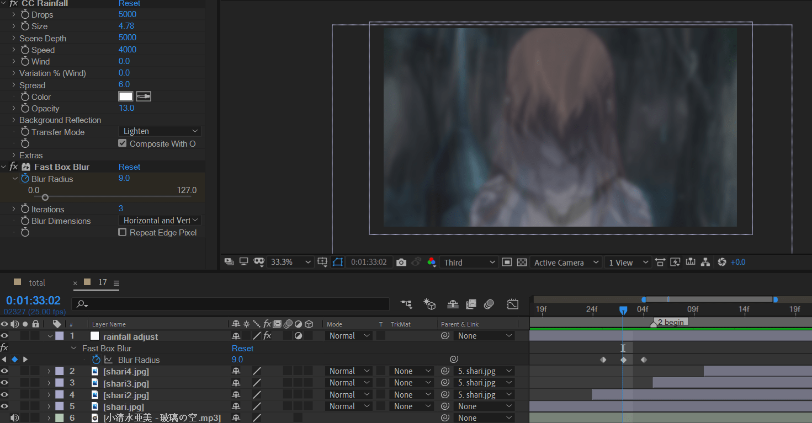

导入素材。bg original应用快速模糊；bg modified是对窗抠图处理后的图片，应用rainfall。

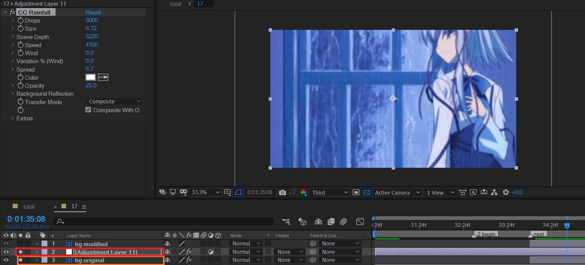

将bg modified眼睛打开。

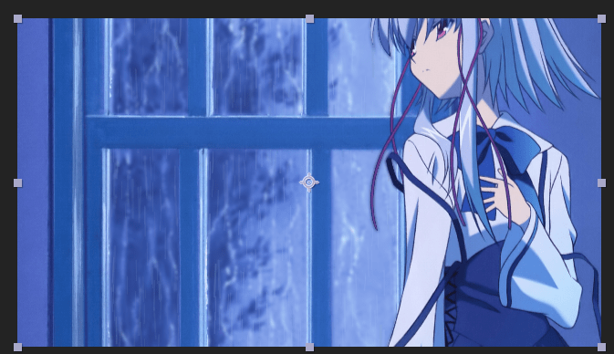

发现窗外需要更暗一点。于是需要给上面的调节层应用色调。全部映射为黑，tint值30%左右。

并将bg original 绑定到 bg modified

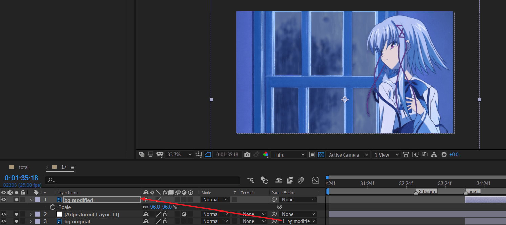

将bg modified复制一层为bg modified 2，然后给bg modified应用hue/saturation

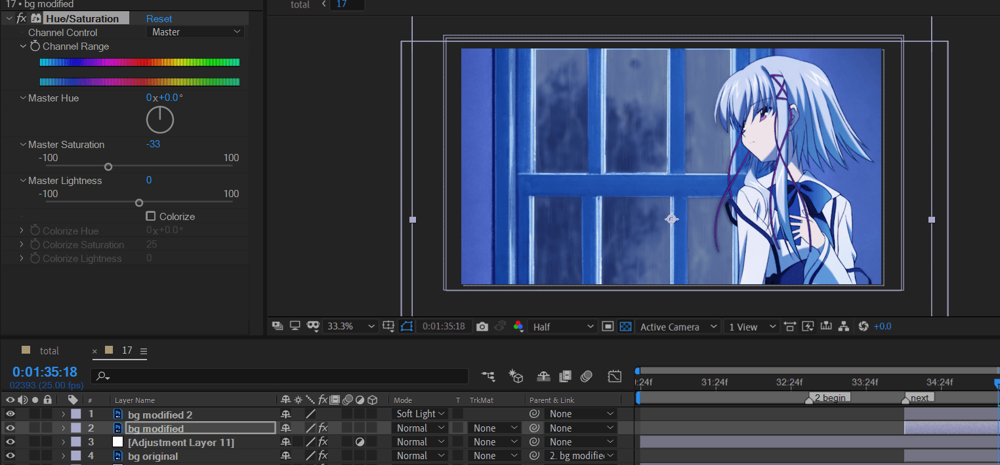

关键地方：给bg modified应用高斯模糊。模糊度调大到40左右。这样人物周围就会有种发亮的效果。

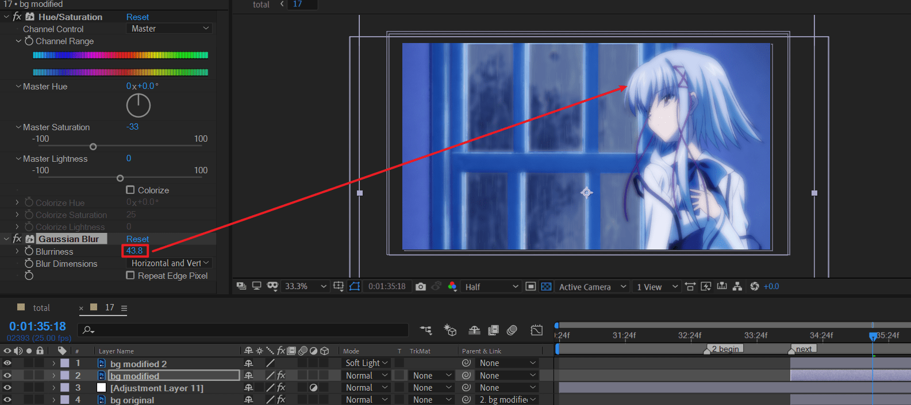

> 现在，将bg modified 和bg modified2都绑定到bg original

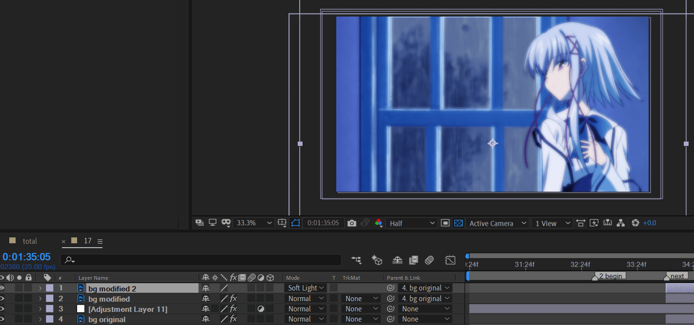

将这四个图层打成预合成，然后再K opacity淡入关键帧。否则不方便处理整体的透明度渐变。

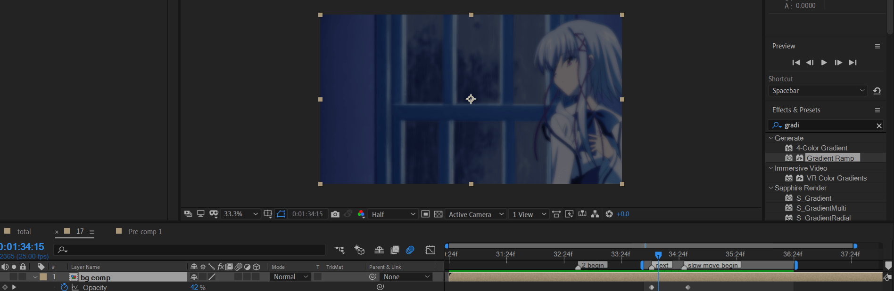

进入合成，k position帧

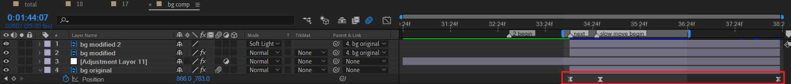
