# 18
<!-- READING-TIME:START -->
>  🕛 reading time: 3 min read | 🔖 words: 476
<!-- READING-TIME:END -->

分析画面

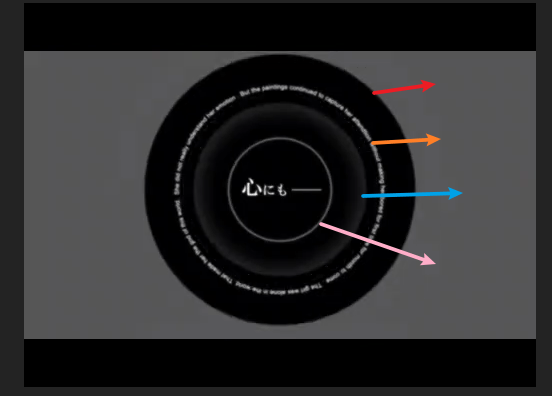

灰色背景。是一个快速消散纯色圆。截图中该圆已经占满画面。

四个同心圆，半径不同。从外到内分别是：

- 黑色纯色圆
- 文字圆（TODO）
- 淡黑色纯色圆
- 描边白色圆

中心是文字层。

【黑色纯色圆】

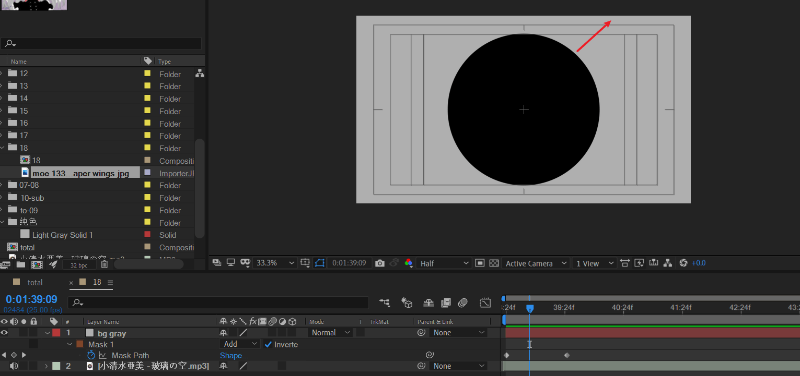

修改名称，并将bg gray复制一层。

- inner black circle lighten时间轴右移一点
- 将mask path invert取消勾选

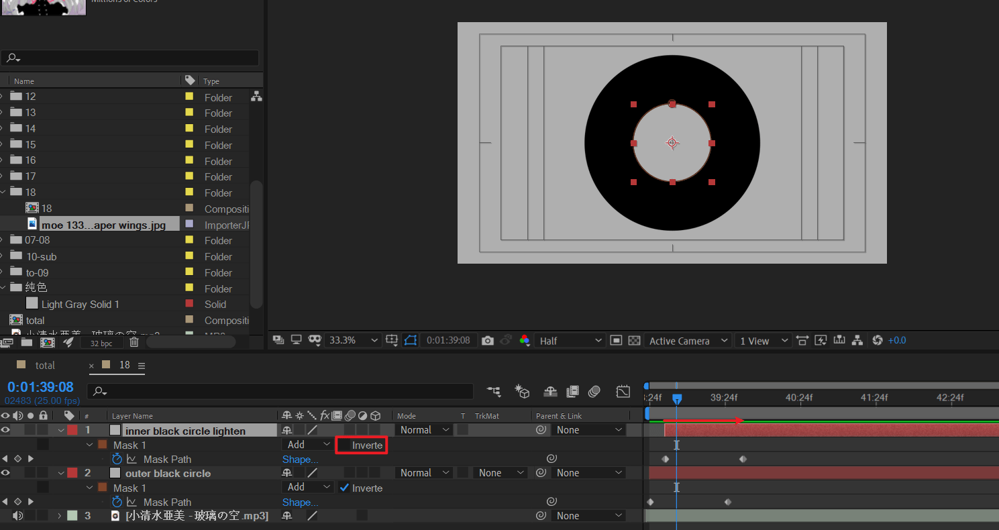

将inner black circle lighten的mask 1复制一层，将mask 2模式改为相减，将关键帧稍微右移。

可以看到图中内部又出现了一个黑色小圆。这个小圆就是mask2

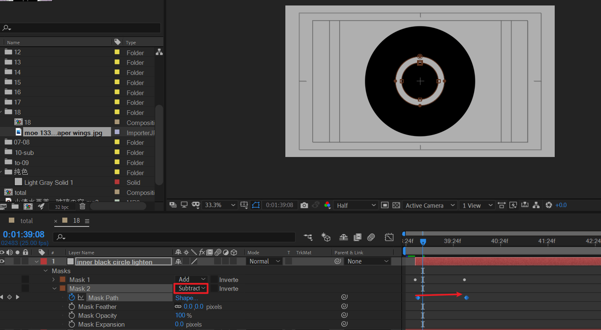

关键：调节mask 2的羽化值。箭头所指的渐变就是羽化的作用。

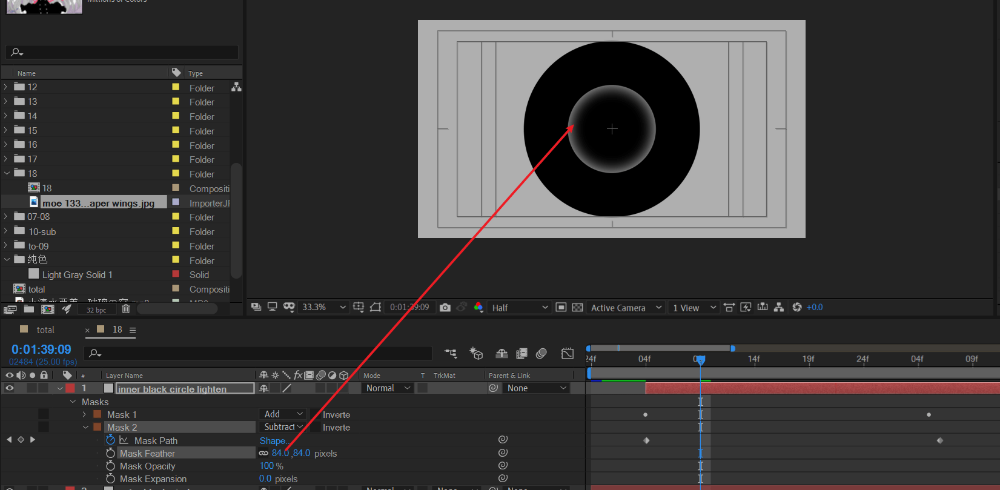

将之前的outer black circle复制一层为inner white circle stroke。给这层应用stroke，将style改为on transparent，更改brush size。

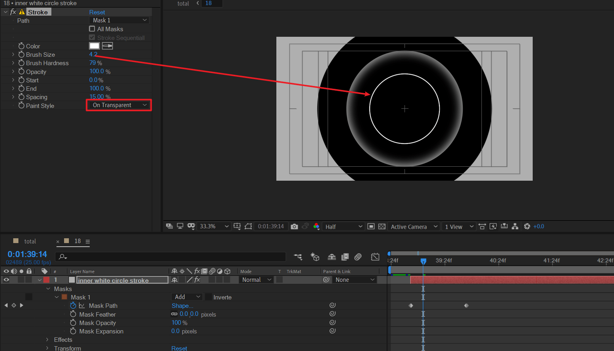

上述圆的结束帧，后续再调整。

---

复制之前的outer black circle两次。按相同原理绘制如下效果。

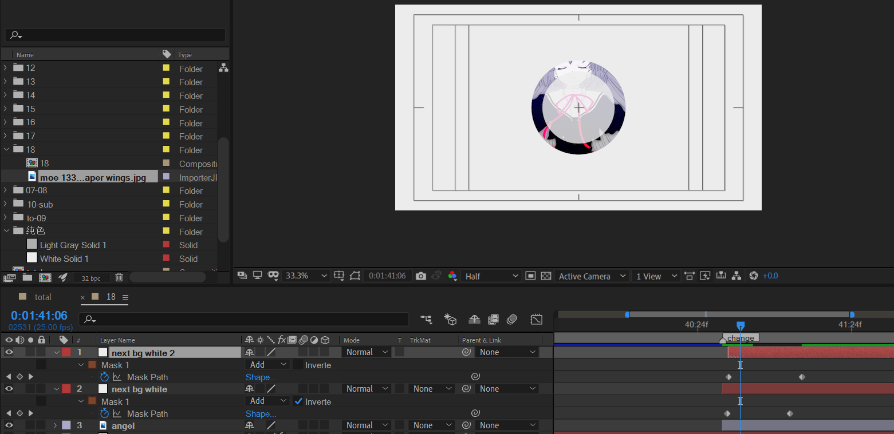

新建纯色层，命名shine，用于底部中间发光。应用of光。

> TODO: 寻找一款类似原作的光晕预设。
>
> 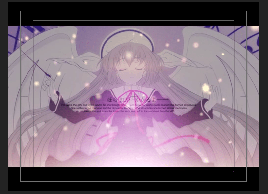

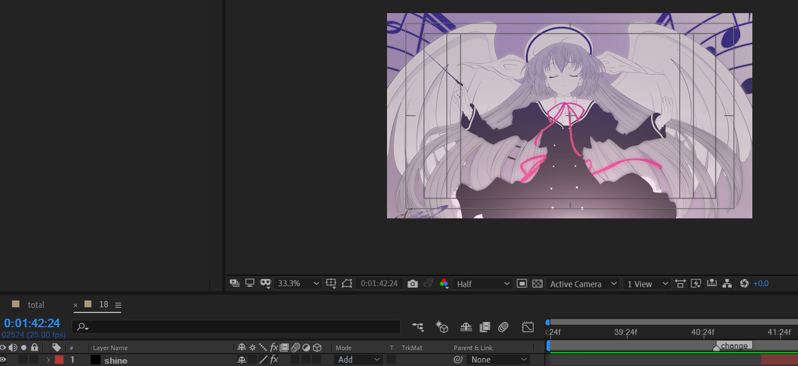

下面制作粒子效果。新建纯色层，应用particular效果。

box类型，单向x +90度，适当调整XYZ发射空间。关键一点是设置color random值为8%左右，这样才会产生随机颜色的例子。

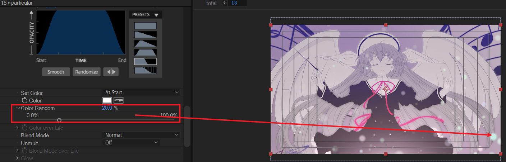

此时，粒子没有发光的效果。需要补充glow效果。主要调整glow radius即可。

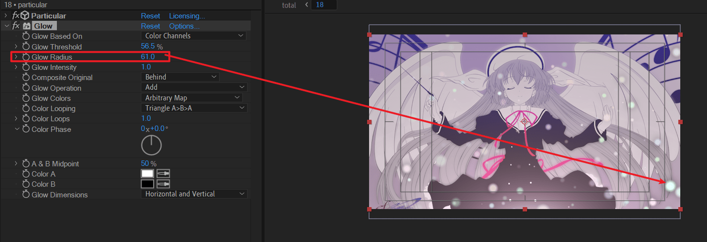

下面考虑该场景消失的转场。

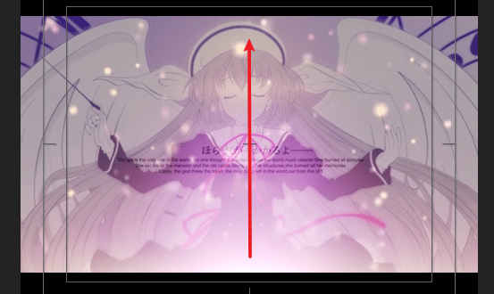

底部发光垂直向上慢慢展开，一直到画面全白。

准确描述应该是什么呢？

> 发光起点为底部中间，越来越亮，同时发光半径越来远大，直到画面全白。

开始帧

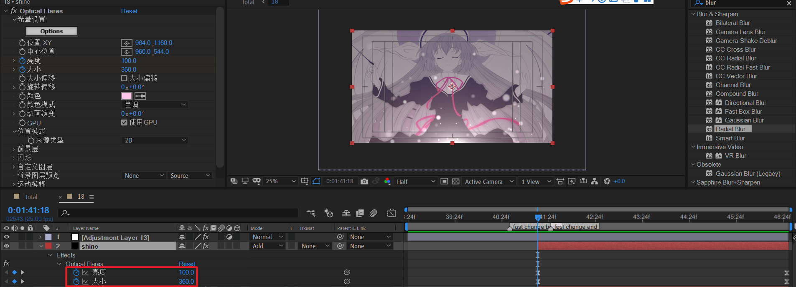

结束帧

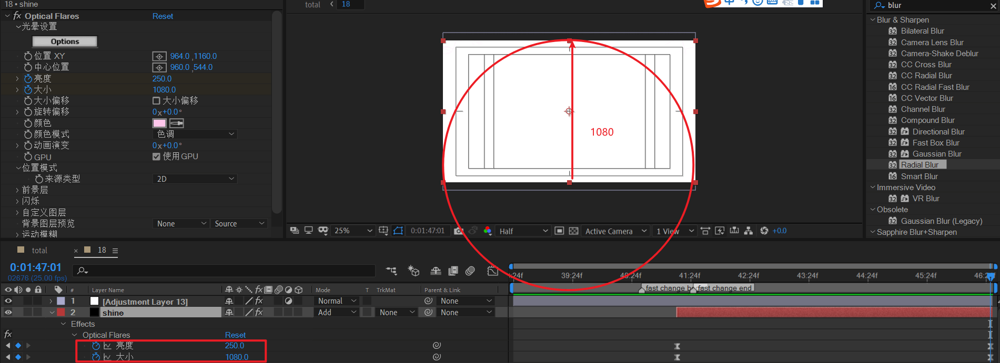

预览

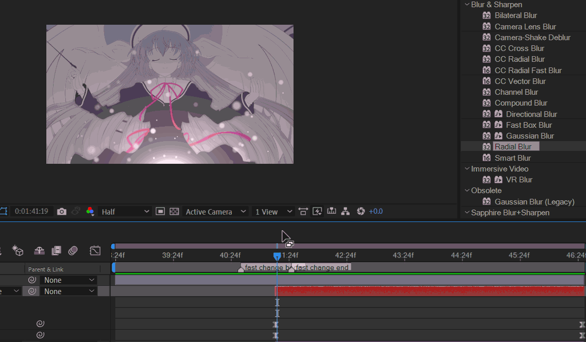
