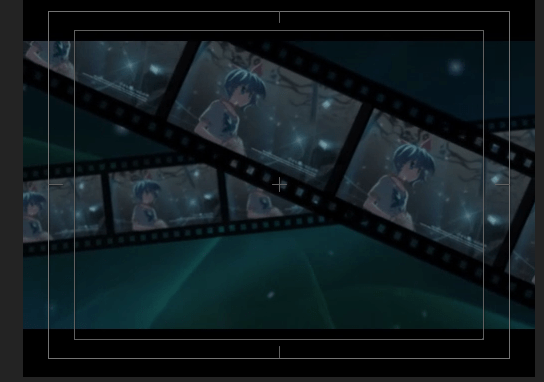
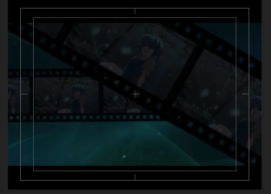
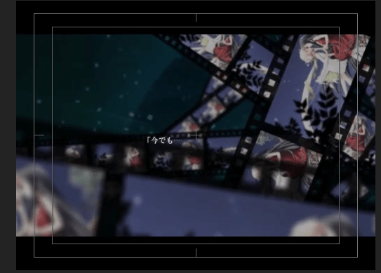
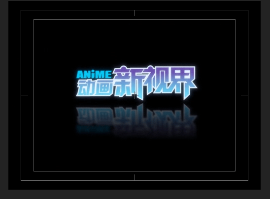
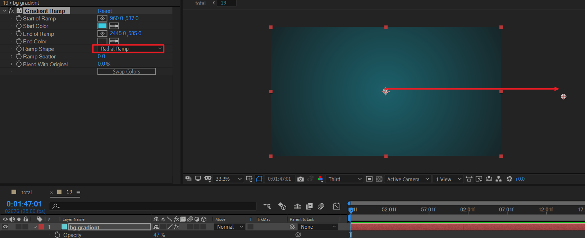
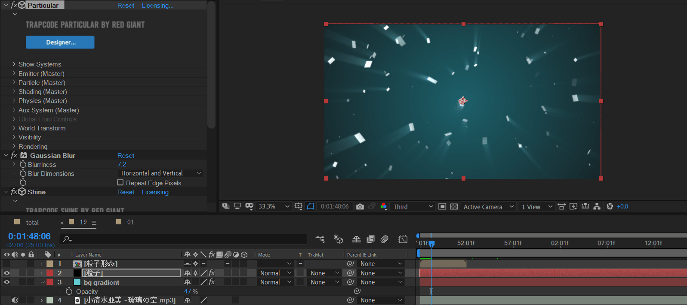
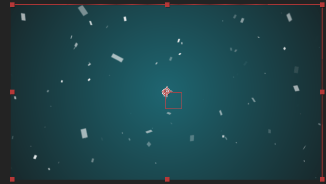
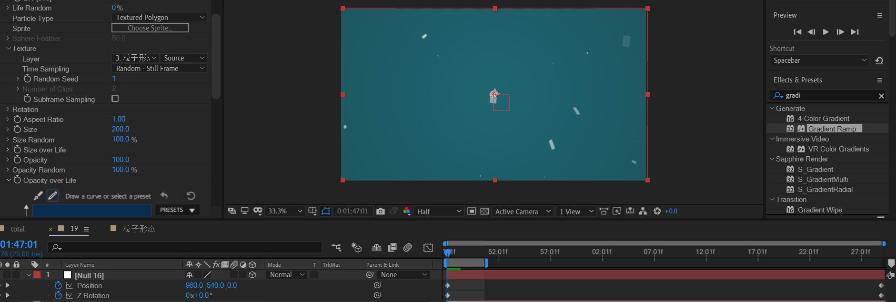

# 19
<!-- READING-TIME:START -->
>  🕛 reading time: 3 min read | 🔖 words: 567
<!-- READING-TIME:END -->

## 准备

到了这里，基本接近尾声了。

后续就是不停的的胶带片段堆叠镜头。

歌词对应片段

```
（以上删除）==============================
[03:32.62] 
[03:37.87]「あなたと见たあの空   玻璃ごしの记忆の向こう
[03:43.62]小指の先程の二人の距离と、あの时感じた鼓动…ニオイ…
[03:53.19]届いたのに届いていないようなそんな思い
[04:01.06]今でも…覚えていますか？」
[04:05.56]
[04:10.13]终
```

裁剪音乐至合成19，时长1:47:01-2:28:24

> 玻璃之空BGM原时长为4:20，《青空》原作者考虑到工作量，所以跳过了一大部分相同旋律，直接取到末尾作为结尾。
>
> mad一般推荐时长为1:00到2:30。

## 分析

取原作分析



背景青色，纯色层渐变可以解决。

粒子方块效果采用particular可以解决。

扫光线条可以采用形状层mask动画实现。

胶带可以复制之前制作的胶带合成来重用，节省工作量。

开始有两个胶带



末尾时最大胶带数为7左右



最末尾补一个制作者logo



胶带将采用手动堆叠图层的方式实现。

## 制作

背景



新建纯色层，应用梯度渐变，将起点定于画面中心，结束点定于画面外稍远。oapcity设置50%左右。

---

粒子效果

> 其他方案：粒子效果也可以使用 CC particle world完成。

复制合成01的粒子图层和粒子形态合成到该合成。



将粒子形态的发光效果删掉，将opacityover life改为永远为1。

将粒子生命改为50s左右。因为这个合成时长为42s左右。取一个大于他的值即可。



整个画面有一个缓慢而且持续的逆时针z轴旋转。而且一直在拉远，视线范围越来越广，通过空对象position的z轴k帧实现。

新建摄像机和空对象，并且绑定。



预览


扫光

使用optical flares完成。注意发光位置在画布外。

----

制作胶带

胶带单元格里面的镜头采集自之前的合成，略有删减。


